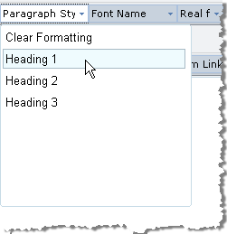

# Paragraph Styles


## 


The Paragraph style dropdown of RadEditor displays a predefined set of styles by default. This set is defined by the **Paragraphs** collection. You can predefine the paragraphs in the **Paragraphs** collection by modifying the **ToolsFile.xml / ListToolsFile.xml** files, located in the following folder:

_/Program Files/Common Files/Microsoft Shared/web server extensions/wpresources/RadEditorSharePoint/6.x.x.0__1f131a624888eeed/Resources/_

**For example:**

````XML
<root>
 <tools name="MainToolbar">
   <tool name="FormatBlock" />
 </tools>
 <paragraphs>
   <paragraph name="Clear formatting" value="<body>" />
   <paragraph name="<H1>Heading 1</H1>" value="<H1>" />
   <paragraph name="<H2>Heading 2</H2>" value="<H2>" />
   <paragraph name="<H3>Heading 3</H3>" value="<H3>" />
   <paragraph name="<p class='redStyle'>redStyle</p>" value="<p class='redStyle'>" />
 </paragraphs>
</root>
````

