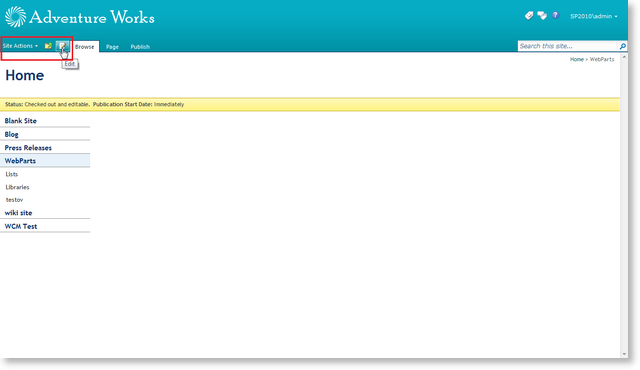
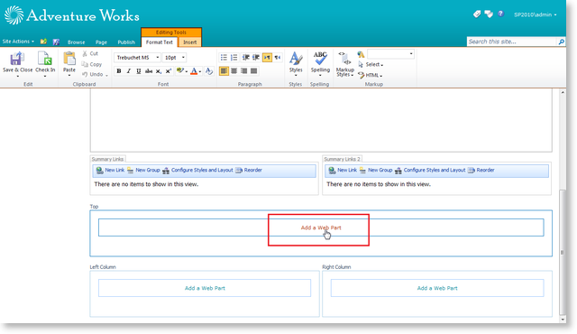
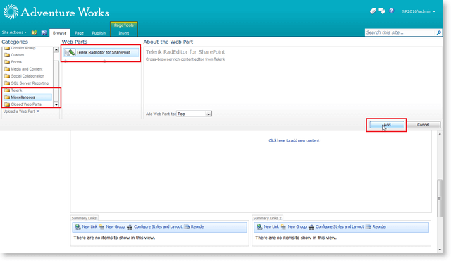
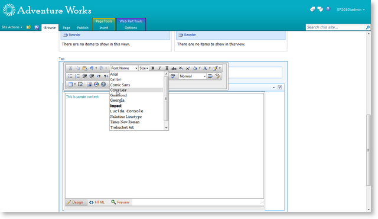
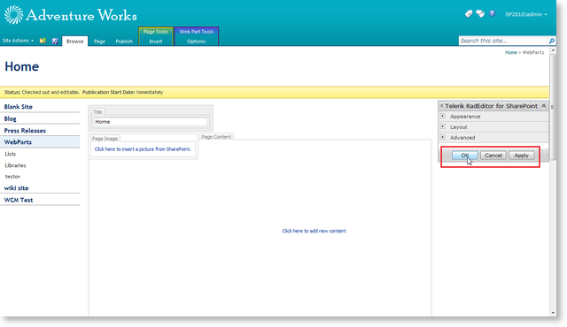

# Getting Started

RadEditor for SharePoint 2010 comes with a special Web Part, which you can use as a cross-browser alternative to the default rich-text editor Web Part. Please, note that the deployment process will not automatically replace existing Web Parts with the new RadEditor Web Part. Since there is no supported way of performing this replacement you should [migrate your existing rich-text editor Web Parts]() manually.

Follow the steps below to add a new RadEditor Web Part to a given page.

1. Open your Web Application and browse to a Web Part page.

1. Click the Edit Page button or select Edit Page from the Site Actions menu.

	

1. Click the Add a Web Part button in one of the Web Part Zones.

	

1. Browse to the *Telerik RadEditor for SharePoint 2010* web part in the **Miscellaneous** category, check it and click the Add button.

	

1. The screenshot below shows RadEditor Web Part in edit mode.

	

1. Once you are done editing the content, click the **Ok** button in the RadEditor options panel.

	

## See Also

 * [Enable RadEditor for editing lists](https://www.telerik.com/support/kb/aspnet-ajax/editor/details/enabling-radeditor-in-sharepoint#Enable-RadEditor-for-editing-lists) (Video)
 * [Migrating Default Rich-text Editor Web Parts]()

 * [List Items Scenario]()

 * [Web Content Management Scenario]()
