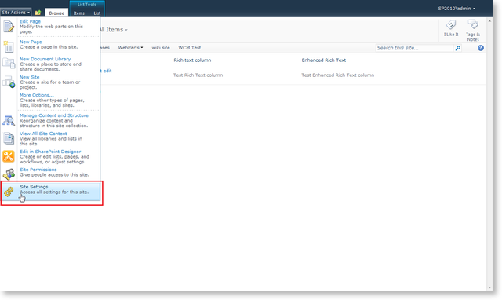
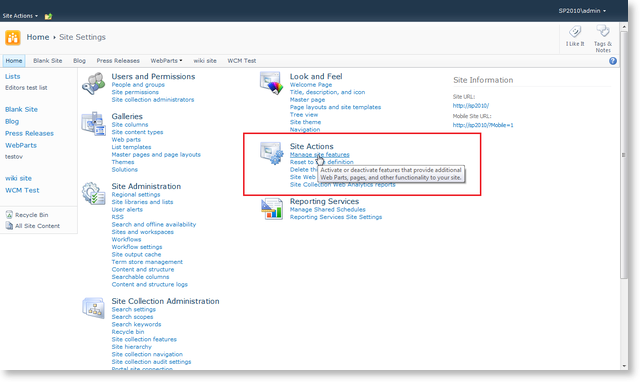

# List Items Scenario

## 

Most of the Office SharePoint Server features are represented as lists. For example, **Blogs**, **announcements**, etc. You can easily replace the editor in these cases with the RadEditor.

>note  **NOTE:** Once the RadEditor for SharePoint 2010 features are activated they will affect only the current site. You need to activate the RadEditor features for each site individually. If you want to change the scope of the features, see the following article - [Change the RadEditor features scope]()
>

1. From the **Site Actions** menu go to **Site Settings**

1. Click **Manage site features** in the **Site Actions** column

1. Scroll to the bottom of the list and activate the **Use RadEditor to edit List Items** feature.

1. **IMPORTANT!** If you still see the default editor or a simple textbox after you activate the RadEditor feature(s), you might need to open a command prompt window and type **iisreset** to reset the Internet Information Server. This will prevent problems caused by caching.

This screenshot below shows RadEditor used to edit a Task description.

## See Also

 * [Getting Started]()

 * [Web Content Management Scenario]()
