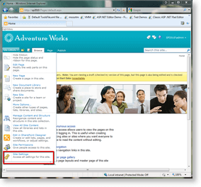
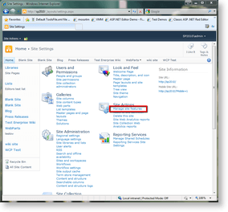
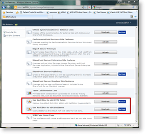
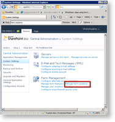
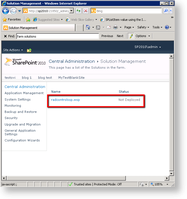
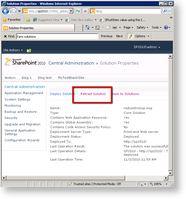
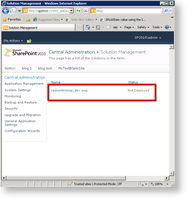
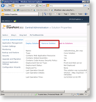

# Uninstalling RadEditor

In general, there are 2 approaches for uninstalling Telerik controls for SharePoint 2010. You could do that either by

1. Using the MS Windows’ Control Panel / Add Remove Programs (Programs and Features in Windows7)

1. OR by using SharePoint’s Central Administration page.

The information below provides details about the second approach. **Still, we strongly recommend following points 1 to 3 (inclusive) from the "*uninstall Telerik RadEditor from your SharePoint 2010 site*" section, when uninstalling the controls via the MS Windows Control Panel applet**.

In order to uninstall RadEditor for MOSS you need to first perform the following preliminary tasks. Note that these tasks are needed ONLY if you do not plan to upgrade to a newer version of RadEditor for MOSS (i.e., you wish to use only the default MOSS editor again):

1. Revert to the default rich-text editor in Web Content Management scenario (do the reverse actions of the ones described in [Using RadEditor in Web Content Management scenario]()).

1. Open the page(s) in which you have used RadEditor for MOSS.

1. Replace the RadEditor tags (telerik:RadHtmlField) with the default editor tags:

	**XML**

		<publishingwebcontrols:richhtmlfield runat="server" id="Content" fieldname="..." />

1. Remove the RadEditor registration line from the top of the page:

	**XML**

		<%@ register tagprefix="telerik" namespace="Telerik.SharePoint.FieldEditor" assembly="RadEditorSharePoint, Version=x.x.x.x, Culture=neutral, PublicKeyToken=1f131a624888eeed" %>

1. Replace all instances of the RadEditor Web Part with the default rich-text editor Web Part:

1. Open a given page for editing

1. Copy the content of a given RadEditor Web Part

1. Delete this RadEditor Web Part

1. Place a default rich-text editor Web Part on its place

1. Paste to copied content inside the Web Part and save it

1. Repeat steps 5-11 for all RadEditor Web Parts on the page.
	
	Once you have performed steps 1 and 2 as described above, please do the following to **uninstall Telerik RadEditor from your SharePoint 2010 site**:

	1. Open your SharePoing site in the browser. From the Site Actions menu go to Site Settings
	
		
	
	1. Click Manage site features link from the Site Actions column.
	
		
	
	1. Scroll to the bottom of the list and deactivate the RadEditor features.
	
		
	
	1. Open the SharePoint Central Administration page.
	
	1. Go to the System Settings and click on Manage farm solutions link from the Farm Management column.
	
		
	
	1. You should see the radcontrolssp.wsp solution in the list. Click on the name link to go to the Solution Properties page.
	
		
	
	1. Choose Retract Solution. On the next page choose when and from which solutions to retract the RadEditor. Then click Ok.
	
		
	
	1. Wait a few minutes. Then refresh the page. The retraction process should be over and you should see the following screen:
	
		
	
	1. Click the name link to open the Solution Properties page again. This time click the Remove Solution button. Then confirm in the dialog box. The solution should be removed from the farm and a confirmation screen will be displayed.
	
		
