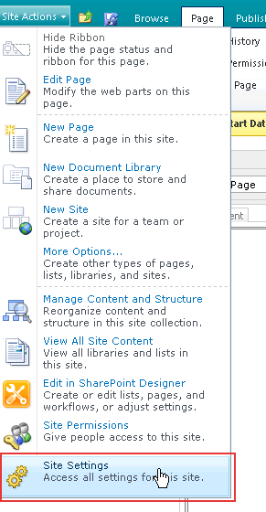
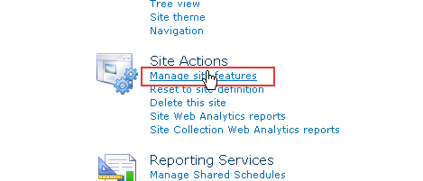
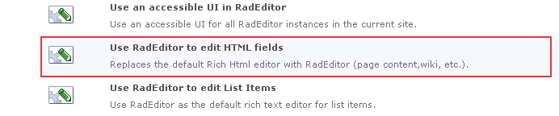
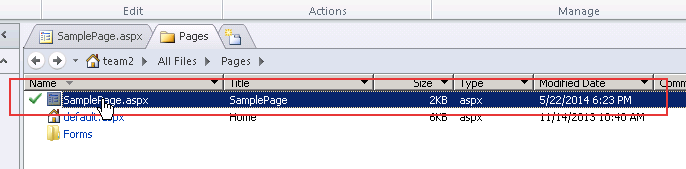
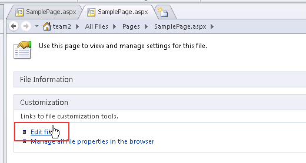
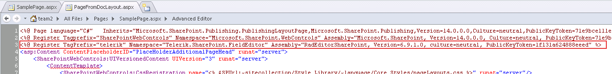
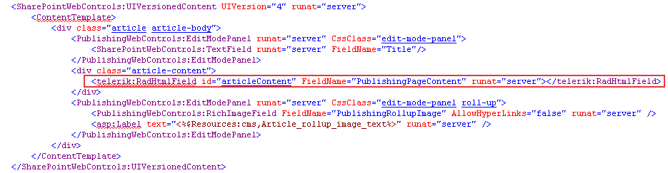

# Web Content Management Scenario


Telerik RadEditor for SharePoint 2010 can be easily used as a cross-browser rich-text editor for Web Content Management in SharePoint 2010. In order to replace the default editor in a page template, you need to perform a one-time modification using SharePoint Designer 2010. All content which has been authored through the default editor will be preserved and accessible through the Telerik RadEditor for SharePoint 2010.

## Using the new feature

>note  __NOTE:__ Once the RadEditor for SharePoint 2010 features are activated, they will affect only the current site. You need to activate the RadEditor features for each site individually. If you want to change the scope of the features, see the following article -[Change the RadEditor features scope]()
>


1. From the __Site Actions__ menu go to __Site Settings__
>caption Figure 1: Selecting Site Setting from the Site Actions menu.



2. Click __Manage site features__ in the __Site Actions__ column.
>caption Figure 2: Navigating to the Site Features page.



3. Scroll to the bottom of the list and activate the __Use RadEditor to edit HMTL fields__ feature.
>caption Figure 3: Location of the 'Use RadEditor to edit HTML fields' feature.



4. __IMPORTANT!__ If you still see the default editor or a simple textbox after you activate the RadEditor feature(s), you might need to open a command prompt window and type __iisreset__ to reset the Internet Information Server. This will prevent problems caused by caching.

## UsingSharePoint Designer

1. Open a page in the __Microsoft Office SharePoint Designer 2010__. Select the page you wish to modify and choose __Edit Page Layout__.
>caption Figure 4: Selecting the page in Microsoft Office SharePoint Designer 2010.



2. Click the __Edit file__ link in the __Customization__ column
>caption Figure 5: Selecting the edit page functionality in the designer.



3. At the top, after the default SharePoint Register tags add the following registration line (replace Version=x.x.x.x with the RadEditor for SharePoint 2010 version, e.g for editor v6.00 use Version=6.0.0.0):

````ASPNET
	<%@ Register TagPrefix="telerik" Namespace="Telerik.SharePoint.FieldEditor" Assembly="RadEditorSharePoint, Version=x.x.x.x, culture=neutral, PublicKeyToken=1f131a624888eeed" %>
````


>caption Figure 6: Adding a Register directive for the RadEditor control.



4. Replace the tag of the default editor __<PublishingWebControls:RichHtmlField ... >__with the RadEditor tag:

````ASPNET
	    <telerik:RadHtmlField id="Content" FieldName="..." runat="server">
	    </telerik:RadHtmlField>
````


>caption Figure 7: Replacing the default RichHtmlField with RadHtmlField.



# See Also

 * [Getting Started]()

 * [List Items Scenario]()
