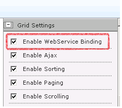

# Client-side Data Binding

SPRadGrid provides the option of binding to SPLists and Excel files on the client. If you prefer a faster loading time and less features, you might as well take advantage of SPRadGrid's client-side binding functionality by switching it on from the tool part GridSettings panel:

The data which the grid is bound to is retrieved through a custom WCF service. Data provision from SQL Server data tables is not supported with client-side binding and neither are insert/update/delete/grouping operations too. SPRadGrid's client-side data-binding is intended for scenarios where the end user experience focuses on fast data display/filtering and sorting.
