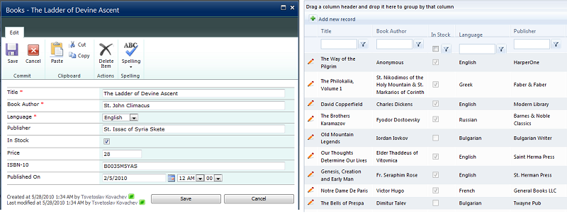

# Displaying and Editing SharePoint List Items

The Web Part SPRadGrid control features a seamless integration with the native SharePoint list display/edit/insert dialogs. If the SharePoint view of the list which the grid is bound to has a link-title column,the data in the column will be rendered as a hyper link that upon clicking will show the display-list-item dialog. Apart from displaying information about the current selected row the dialog will further give you the opportunity to edit/delete the item, manage permissions for it, download any associated attachments, etc.

In order to insert a new item into the displayed list or edit/delete an existing one you need to have the necessary permissions for the corresponding operation. If the user lacks those RadGrid will hide its Command Item (through which new records are added) and will not create an edit and delete columns. The CRUD operations on the SharePoint list can explicitly be stopped through the Enable Insert/Update/Delete web part properties even if the user has permissions for performing such actions on the list

As already mentioned in the topic on Configuring the SPRadGrid Web Part through ToolPart, you can set the grid to use either SharePoint dialogs or RadGrid's edit/insert-forms mechanism for adding/editing items of the list which the grid is currently bound to. This setting is controlled through the **User Internal Editing** property on the**Grid Settings** tool pane.

Editing/inserting list items through SharePoint's native dialogs gives the additional benefit of the powerful functionality provided through the SP Ribbon tool bar.

Telerik SPRadGrid takes into account most of the various special fields that might be present in the list currently displayed in the grid. Upon encountering any of those in the currently selected list view,RadGrid will create a column into its structure that's best suited to the specificity of the field.Choice fields are mapped to drop-down columns, multi-line text fields - to HTML-editor columns, hyperlink/image fields to a hyperlink/image columns, user fields to hyper link columns,that allow redirection to the corresponding user profile, etc.

In addition Telerik SP RadGrid allows for the various properties of the view fields and adjusts its columns settings to reflect them. Such properties are those indicating whether the field is filterable/sortable and if it has any aggregate functions defined for it.

>note 
>Document libraries are currently not well supported.

