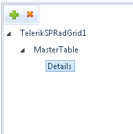
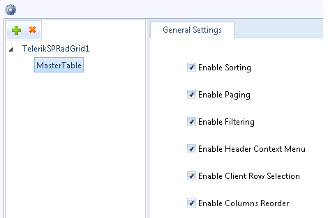

# Hierarchical Data

## 

SPRadGrid Designer makes it possible to manipulate a **hierarchy** of data coming from tables lying on **SQL Server databases**and **SharePoint lists**. Please, go through the [SPRadGrid Designer and SQL/Excel/SPList Binding]() topic for general instructions on working with the the designer.

The Web Part designer provides the option to construct the general hierarchical structure of the grid. You have the opportunity to add/delete detail table views from the tool bar above the top left tree view:

To set the most important properties of for each table view (such as Paging, Filtering, Sorting and others)choose it from the top left grid structure tree, select the General Settings node from the lower left splitter pane and work with the General Properties tab that should appear in the top right of the Designer:

Use the SQL/Excel/SPList Explorers to select the underlying data-source for each table view as described in the [SPRadGrid Designer and SQL/Excel/SPList Binding]() topic.

If the currently selected grid table view is a detail one you will be given the additional option to specify master-child relations:

Choose an item from the master-field combo, related to one from the child field drop-down and hit the Add Relation button. If you need to specify multiple-field	relations, just repeat the steps above.

>note
>hierarchical data is not supported with Excel binding.
>

To see a live example of the above-described functionality, please, visit [http://telerik.sharepoint.com](http://telerik.sharepoint.com) at the WebParts -> Telerik SPRadGrid Hierarchy page.
