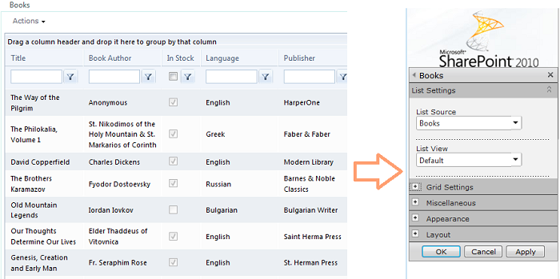
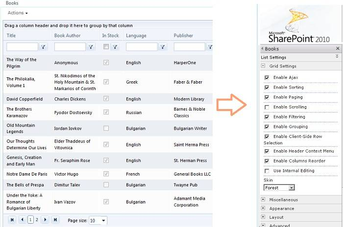

# ToolPart Configuration

## List Settings Tool Pane

Telerik SPRadGrid WebPart comes with a tool-part menu for changing list data and list view display as well as switching on/off RadGrid's most important capabilities.The tool-part is shown through the "Edit Web Part" option on the web part menu.

The tool-part features two custom property-setting tool panes.The List Settings one allows for binding the RadGrid control to a SharePoint list or view different from the currently selected one. Upon the selection of a list different than the current one,the web part will make a post back in order to retrieve the SP Views associated with the new list. After having set the SharePoint list and view to bind the grid control too, you need to go to the Grid Settings pane and make sure that the BindingMode property is set to **SingleSPList**. Afterwards, you can safely pick the desired view and click the OK or Apply button.

Upon parsing the information in the currently-selected view of the list,RadGrid will take into account the view settings and adjust its properties accordingly.If the view is paged RadGrid will switch on its paging and adjust the page size to reflect the one set for the view.If any sort/filter or grouping conditions are defined for the view,RadGrid will create the corresponding sort/filter or group-by expressions and add them to its master table view.

## Grid Settings Tool Pane

Through the GridSettings pane various features of SPRadGrid, such as filtering/grouping/paging/etc. can be turned on/off. Furthermore, you can explicitly switch off the grid control's insert/update/delete operations through the **Enable Insert/Update/Delete** properties. If the CRUD operations are turned on, SPRadGrid will take into account if the user has the permissions necessary for the corresponding operation and only after that allow it. The skin of the RadGrid controls is controlled from this tool pane as well.

Another important setting to take into consideration is the option to enable/disable internal editing for the grid through the **Use Internal Editing** property.It gives you the opportunity to choose the edit/insert mode to use for the manipulation of the SP List items. When this property has been checked, RadGrid will resort to using its own internal edit-forms mechanism for the purpose, otherwise - SharePoint native dialogs will be employed. More information on that you can find in the **[Displaying and Editing SharePoint List Items]()** topic.

## Binding Mode

Particular attention should be paid to the Binding Mode property.The relevant Binding Mode options are respectively: **SQL**, **SPList** and **SingleSPList**.You should choose **SQL** if you have previously bound the grid control to a SQL Server database table through the SPRadGrid designer and now you need just to set some of its properties through the ToolPart.That means that the grid control will remain bound to the SQL table but its properties will change in accordance with the settings in the tool part. The same goes for the **SPList** option the only difference being that in this case you should have the grid control previously bound to a SharePoint list.**SingleSPList** should be chosen when you need not only to adjust the grid properties but also to bind the control to a single SharePoint list that you need to choose through the List settings combos.
