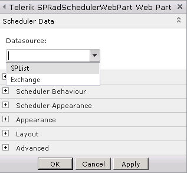
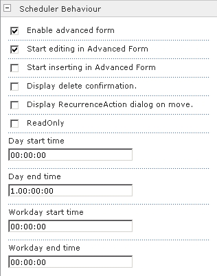
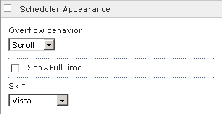

# Getting Started

## SPRadScheduler Settings Tool Pane

Telerik SPRadScheduler WebPart comes with a tool-part menu for changing the control data source as well as switching on/off SPRadScheduler's most important capabilities. The tool-part is shown through the "Edit Web Part" option on the web part menu.

The tool-part features four custom property-setting tool panes:

* Scheduler Data tool pane allows setting and configuring the data source of the control.

	

* Scheduler Layout pane allows setting the SPRadScheduler SelectedView and the GroupBy properties

	

* Scheduler Behavior can be used for enabling and configuring the SPRadScheduler Advanced Form and some of the most often used control properties as: EnableAdvancedForm, StartEditingInAdvancedForm, ReadOnly, DayStartTime, DayEnd time and etc.

	

* Scheduler Appearance allows setting the control Skin, OverflowBehaviour and ShowFullTime properties.

	
