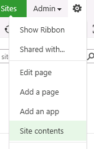

# Create an AJAX-enabled SharePoint WebPart with Telerik Controls


## 

This article shows how to create an AJAX-enabled SharePoint WebPart that uses Telerik UI for ASP.NET AJAX.It is assumed that you already have SharePoint WebParts for ASP.NET AJAX installed and configured on the target SharePoint installation or the Telerik UI for ASP.NET AJAX are [deployed on the machine]() (this is done automatically when the SharePoint WebParts for ASP.NET AJAX are installed).

The following steps describe the creation of the WebPart:

1. Create a new Visual WebPart project in Visual Studio:

1. Reference the assemblies __Telerik.Web.UI.dll__ and __Telerik.Web.UI.Skins.dll__ in the project.

1. Open the ASCX file and add the following __Register__ directive in order to be able to use the Telerik controls in this web part:

````XML
	    <%@ register tagprefix="telerik" namespace="Telerik.Web.UI" assembly="Telerik.Web.UI, Version=x.x.x.x, Culture=neutral, PublicKeyToken=121fae78165ba3d4" %>    
````


>note Note that the version of the assembly is specified in the Assembly attribute. If deploying a different version of Telerik UI for ASP.NET AJAX, ensure that the version number is correct here.
>


1. This is all the preparation you need to start using Telerik UI for ASP.NET AJAX in your Visual WebPart. Simply add the following code in the ASCX file of the web part and inits code-behind. It will insert a RadRotator control that is data-bound to the __Images__ library of the site collection:

````ASPNET
	        <telerik:RadRotator runat="server" ID="RadRotator1" Width="190px" Height="113px" 
	            ItemWidth="150px" ItemHeight="113px" RotatorType="Buttons">
	            <ItemTemplate>
	                ' />
	            </ItemTemplate>
	        </telerik:RadRotator>
````


````C#
	    protected void Page_Load(object sender, EventArgs e)
	    {
	        using (var site = new SPSite("http://websitename"))
	        {
	            using (var web = site.OpenWeb())
	            {
	                var list = web.Lists["Images"];
	                RadRotator1.DataSource = list.Items.GetDataTable();
	                RadRotator1.DataBind();
	            }
	        }
	    }
````


````C#
	    protected void Page_Load(object sender, EventArgs e)
	    {
	        using (var site = new SPSite("http://websitename"))
	        {
	            using (var web = site.OpenWeb())
	            {
	                var list = web.Lists["Images"];
	                RadRotator1.DataSource = list.Items.GetDataTable();
	                RadRotator1.DataBind();
	            }
	        }
	    }
````
````VB
	    Protected Sub Page_Load(sender As Object, e As EventArgs) Handles Me.Load
	        Using site = New SPSite("http://websitename")
	            Using web = site.OpenWeb()
	                Dim list = web.Lists("Images")
	                RadRotator1.DataSource = list.Items.GetDataTable()
	                RadRotator1.DataBind()
	            End Using
	        End Using
	
	    End Sub
	#End Region
	
	End Class
````


1. If the __Images__ library is empty, at least two images will have to be inserted in it for the proper functionality of the rotator control. This can be done by:

1. Selecting __Site Content__ from the setting dropdown:

1. Selecting the __Images__ library (or a custom pictures library):

1. Inserting the images:

1. After the rotator is added on the web part and it is data-bound to the images, the Deploy Web Part option in the Build menu can be used to build and deploy theWeb Part to SharePoint. You should now be able to add the Web Part to your pages:

1. Clicking the left and right buttons of the rotator will scroll its items:
