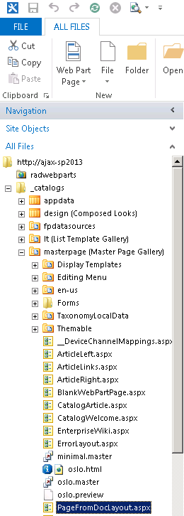

# Incorporating Telerik® UI for ASP.NET Ajax

Once the Telerik® UI for ASP.NET Ajax are deployed, you can easily integrate them in your SharePoint site.

The following steps outline how to insert an HTML5 Chart in a SharePoint page:

1. Launch SharePoint Designer 2013 and open the desired SharePoint site.

1. Within the Navigation window locate the page in which you want to insert the Chart. The page **PageFromDocLayout.aspx** will be used for the purpose of this demonstration. It is located in **http://server_name/_catalogs/masterpage** as shown in the following screenshot

	

1. Open the selected page for editing. If prompted to check out the file select “Yes”.

1. Now you need to register the Telerik.Web.UI assembly in the master page. Do so by adding the following code after the last **Register** directive:
	
	**XML**

		<%@ register tagprefix="telerik" namespace="Telerik.Web.UI" assembly="Telerik.Web.UI, Version=x.x.x.x, Culture=neutral, PublicKeyToken=121fae78165ba3d4" %>    

	>note Note that the version of the assembly is specified in the Assembly attribute. If deploying a different version of Telerik® UI for ASP.NET Ajax, ensure that the version number is correct here.

1. Add the following code in the edited page (for example in the Content with **ContentPlaceholderID** set to **PlaceHolderMain**):

	>important The code below is added in a SharePoint content page which means a ScriptManager instance is not required there because it already presents in the master page. For standard .aspx pages you must manually add ScriptManager.

	ASP.NET

		<telerik:RadHtmlChart runat="server" ID="PieChart1" Width="800" Height="500">
		    <Appearance>
		    </Appearance>
		    <ChartTitle Text="Browser Usage for April 2012">
		    </ChartTitle>
		    <PlotArea>
		         <Appearance>
		              <FillStyle BackgroundColor="White"></FillStyle>
		         </Appearance>
		         <Series>
		              <telerik:PieSeries StartAngle="90">
		                   <LabelsAppearance Position="OutsideEnd" DataFormatString="{0} %">
		                   </LabelsAppearance>
		                   <TooltipsAppearance DataFormatString="{0} %"></TooltipsAppearance>
		                   <Items>
		                        <telerik:SeriesItem BackgroundColor="#ff9900" Exploded="true" Name="Internet Explorer"
		                             YValue="18.3"></telerik:SeriesItem>
		                        <telerik:SeriesItem BackgroundColor="#cccccc" Exploded="false" Name="Firefox" YValue="35.8">
		                        </telerik:SeriesItem>
		                        <telerik:SeriesItem BackgroundColor="#999999" Exploded="false" Name="Chrome" YValue="38.3">
		                        </telerik:SeriesItem>
		                        <telerik:SeriesItem BackgroundColor="#666666" Exploded="false" Name="Safari" YValue="4.5">
		                        </telerik:SeriesItem>
		                        <telerik:SeriesItem BackgroundColor="#333333" Exploded="false" Name="Opera" YValue="2.3">
		                        </telerik:SeriesItem>
		                   </Items>
		              </telerik:PieSeries>
		         </Series>
		    </PlotArea>
		</telerik:RadHtmlChart>   	

1. Save your page file and check it in. If you check your page in the browser you should see that the HTML5 Chart appears.

	
