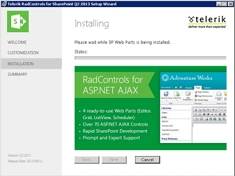

# Installing Telerik Web Parts

## Automatic Installation, Upgrade and Removal

Telerik Web Parts for SharePoint 2013 come in a common .wsp solution that contains all the necessary files and deployment information for the Web Parts to be successfully installed on your SharePoint application. In addition, the .wsp is accompanied by an installer that can automatically perform the installation for you. Just download and run the installer application:

Behind the scene the installer runs the SP PowerShell deployment commands that automatically deploy the necessary dlls to the GAC, register the corresponding assemblies to the SafeControls section of the SP web.config and add the solution to the SP application. During the installation:

* the following three assemblies are deployed to the GAC: **Telerik.Web.UI.dll, Telerik.Ajax.SharePoint.dll and RadEditorSharePoint.dll.**

* the following entries are added to the SafeControls section of the SP web.config file:

	**XML**

		<SafeControl Assembly="Telerik.Web.UI, Version=..., Culture=neutral, PublicKeyToken=121fae78165ba3d4"
		    Namespace="Telerik.Web.UI" TypeName="*" Safe="True" SafeAgainstScript="False" />
		<SafeControl Assembly="Telerik.Web.UI, Version=..., Culture=neutral, PublicKeyToken=121fae78165ba3d4"
		    Namespace="Telerik.Web.UI.Editor" TypeName="*" Safe="True" SafeAgainstScript="False" />
		<SafeControl Assembly="Telerik.Web.UI, Version=..., Culture=neutral, PublicKeyToken=121fae78165ba3d4"
		    Namespace="Telerik.Web.UI.Widgets" TypeName="*" Safe="True" SafeAgainstScript="False" />
		<SafeControl Assembly="Telerik.Web.UI, Version=..., Culture=neutral, PublicKeyToken=121fae78165ba3d4"
		    Namespace="Telerik.Web.Design" TypeName="*" Safe="True" SafeAgainstScript="False" />
		<SafeControl Assembly="RadEditorSharePoint, Version=6.0.0.0, Culture=neutral, PublicKeyToken=1f131a624888eeed"
		    Namespace="Telerik.SharePoint" TypeName="*" Safe="True" SafeAgainstScript="False" />
		<SafeControl Assembly="RadEditorSharePoint, Version=6.0.0.0, Culture=neutral, PublicKeyToken=1f131a624888eeed"
		    Namespace="Telerik.SharePoint.FieldEditor" TypeName="*" Safe="True" SafeAgainstScript="False" />
		<SafeControl Assembly="RadEditorSharePoint, Version=6.0.0.0, Culture=neutral, PublicKeyToken=1f131a624888eeed"
		    Namespace="Telerik.SharePoint.ListFieldEditor" TypeName="*" Safe="True" SafeAgainstScript="False" />
		<SafeControl Assembly="Telerik.Ajax.Sharepoint, Version=1.0.0.0, Culture=neutral, PublicKeyToken=aa9e5f693af67c7b"
		    Namespace="Telerik.Ajax.SharePoint" TypeName="*" Safe="True" SafeAgainstScript="False" />

Once installed and deployed, the Telerik Web Parts can be easily upgraded/removed through the same installer application. The latter automatically detects if the controls have already been deployed and will give you the option to either Repair (Upgrade) or Remove them.

## Manual Installation, Upgrade and Removal

If you prefer to manually perform the above-described process, you can easily do so through the SP PowerShell cmd lets.

1. Install the RadControlsSP solution as follows:

	 **`Add-SPSolution - LiteralPath <full path="" to="" the="" RadControlsSP.wsp="" file="">`**

	 **`Install-SPSolution -Identity RadControlsSP.wsp -AllWebApplications -GACDeployment -Force`**

1. Upgrade your RadControlsSP solution as follows:

	 **`Update-SPSolution –Identity RadControlsSP.wsp –LiteralPath <full path="" to="" the="" RadControlsSP.wsp="" file=""> –GACDeployment`**

1. Removing the RadControlsSP solution is achieved through the following cmdlets. Just keep in mind that the retraction of the solution should be finished before executing the **Remove-SPSolution** cmdlet:

	**`Uninstall-SPSolution -Identity RadControlsSP.wsp –AllWebApplications`**

	**`Remove-SPSolution -Identity RadControlsSP.wsp`**

## Enabling SPRadGrid Feature

The Telerik SPRadGrid Web Part is deployed as a site collection feature. Therefore, after the addition and deployment of the web part you need to activate the feature associated with it. To do so, you can either go to **Site Actions -> Site Settings -> Site Collection Administration -> Site Collection Features** and enable the **SPRadGrid Feature**, or alternatively run the following **SP PowerShell** command:

**`Enable-SPFeature TelerikSPRadGridWebPart_SPRadGridFeature -Url <url of your SP site>`**
