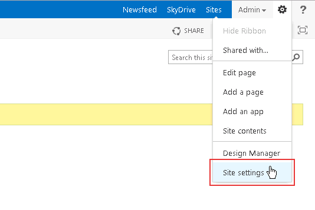
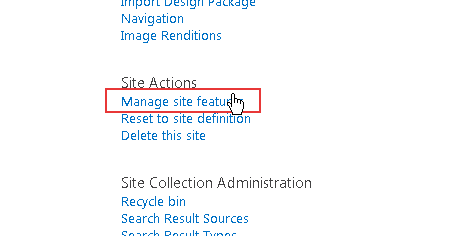
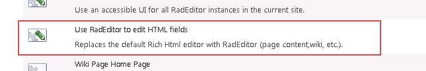
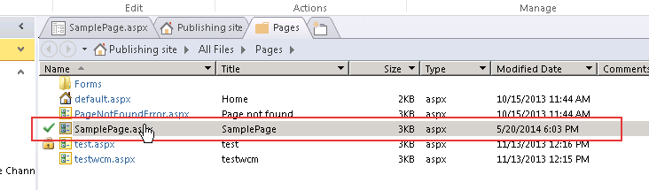
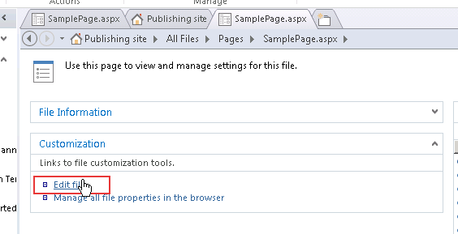
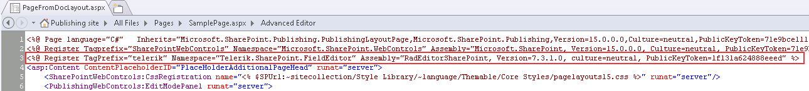
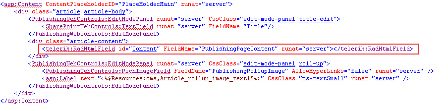

# Web Content Management Scenario

Telerik RadEditor for SharePoint 2013 can be easily used as a cross-browser rich-text editor for Web Content Management in SharePoint 2013.In order to replace the default editor in a page template, you need to perform a one-time modification using SharePoint Designer 2013.All content which has been authored through the default editor will be preserved and accessible through the Telerik RadEditor for SharePoint 2013.

>tip Once the RadEditor for SharePoint 2013 features are activated, they will affect only the current site.You need to activate the RadEditor features for each site individually or change the scope of the features.

## Enabling RadEditor for WCM Scenarios

1. From the **Site Actions** menu go to **Site Settings**

	>caption Figure 1: Selecting Site Setting from the Site Actions menu.
	
	

1. Click **Manage site features** in the **Site Actions** column.

	>caption Figure 2: Navigating to the Site Features page.

	

1. Scroll to the bottom of the list and activate the **Use RadEditor to edit HMTL fields** feature.

	>caption Figure 3: Location of the 'Use RadEditor to edit HTML fields' feature.

	

1. **IMPORTANT!** If you still see the default editor or a simple textbox after you activate the RadEditor feature(s),you might need to open a command prompt window and type **iisreset** to reset the Internet Information Server.This will prevent problems caused by caching.

## Using SharePoint Designer

1. Open a page in the **Microsoft Office SharePoint Designer 2013**. Select the page you wish to modify and choose **Edit Page Layout**.

	>caption Figure 4: Selecting the page in Microsoft Office SharePoint Designer 2013.

	

1. Click the **Edit file** link in the **Customization** column.

	>caption Figure 5: Selecting the edit page functionality in the designer.

	

1. At the top, after the default SharePoint Register tags add the following registration line(replace Version=x.x.x.x with the RadEditor for SharePoint 2013 version, e.g for editor v7.00 use Version=7.0.0.0):

	**ASP.NET**

		<%@ Register TagPrefix="telerik" Namespace="Telerik.SharePoint.FieldEditor" Assembly="RadEditorSharePoint, Version=x.x.x.x, culture=neutral, PublicKeyToken=1f131a624888eeed" %>  

	>caption Figure 6: Adding a Register directive for the RadEditor control.

	

1. Replace the tag of the default editor **`<PublishingWebControls:RichHtmlField ... >`** with the RadEditor tag:

	**ASP.NET**

		<telerik:RadHtmlField id="Content" FieldName="..." runat="server">
		</telerik:RadHtmlField>

	>caption Figure 7: Replacing the default RichHtmlField with RadHtmlField.

	

## See Also

 * [Getting Started]()
