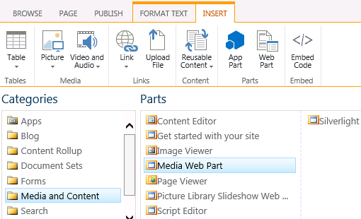
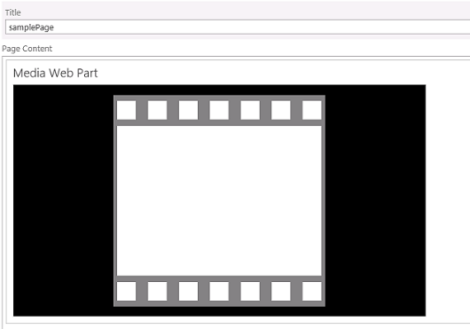
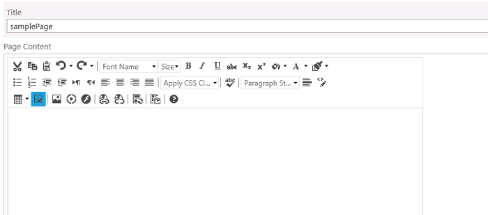
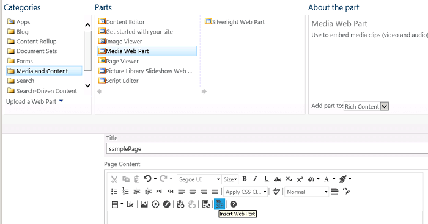

# Known Issues

This article describes known issues with integrating the Telerik controls in SharePoint (all versions). Telerik does not (yet) have solutions for these issues. This article will feature a common scenario with editing Web Parts inside **RadEditor** for SharePoint.

## Web Parts Cannot Be Edited in RadEditor for SharePoint

**RadEditor** for SharePoint does not support editing Web Parts in its content. There are two scenarios, in which you can encounter this limitation:

* When you **insert a Web Part in the standard field for editing** the content of a SharePoint page and **later** enable the feature **Use RadEditor to edit HTML fields**. The Web Part will be missing from the content of **RadEditor** for SharePoint when you edit the page again.

* When you insert a Web Part in an already enabled **Use RadEditor to edit HTML fields**, the Web Part will not be displayed in the edited SharePoint page and it will not be added in the saved page.

Both cases are described in more detail in the following sections.

### Enabling the feature "Use RadEditor to edit HTML fields" when you already added a Web Part on the page via the default editor breaks the Web Part

The following steps describe the most common example for this case:

1. You insert a Web Part in the text area for editing the content of the SharePoint page as shown in **Figure 1**.

	>caption Figure 1: Adding a Web Part from the ribbon bar of the SharePoint site.

	

1. You can see a visual representation of the added Web Part in the Page Content text area of the edited page. **Figure 2** shows the Media Web Part of SharePoint in the Page Content text area.

	>caption Figure 2: Visualization of the inserted Web Part in the Page Content text area.

	

1. After you save the SharePoint page, the Web Part will be included in the page and it will be functional.

1. You enable the feature **Use RadEditor to edit HMTL fields**, as described in the article [Using RadEditor in Web Content Management scenario]().

1. When you start editing the page where you added the Web Part, you will see a **RadEditor** for SharePoint in the place of the standard Page Content text area. The Web Part in the content of the editor will be missing in a fashion similar to **Figure 3**.

	>caption Figure 3: The Web Part no longer appears when the RadEditor to edit HTML fields feature is enabled.

	

1. If you save the page, the Web Part will still be there, however if you edit the content of the page via the **RadEditor** for SharePoint, the Web Part will disappear.

### Web Parts cannot be edited in a page that has the feature "Use RadEditor to edit HTML fields" already enabled

The most common case when this limitation is hit is when you have already activated the **RadEditor** for Web Content Management scenario and you want to add a Web Part inside.

1. You would use the ribbon bar from **Figure 1** or the **Insert Web Part** command of **RadEditor** for SharePoint for adding Web Parts while editing the Web Part page that is displayed in **Figure 4**.

	>caption Figure 4: RadEditor’s command for inserting Web Parts.

	

1. When you select and add the Web Part for editing, it does not show in the content area of **RadEditor** for SharePoint, similar to **Figure 3**.

1. If you save the changes in the content, the Web Part will not be included the page.

## See Also

 * [Using RadEditor in Web Content Management scenario]()

 * [Using the RadEditor WebPart]()
