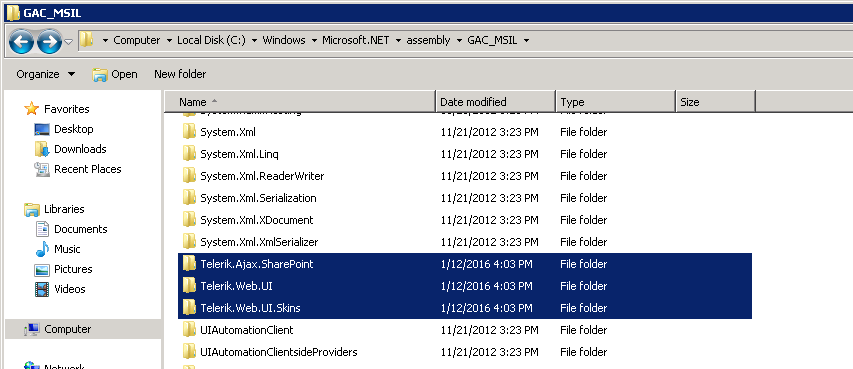

# SharePoint Update Issues

There are some common issues which might be observed after you update Telerik WebParts for SharePoint. This help article lists some of them with suggestions how to resolve the issues.

## Check if the update succeeds. 

In almost all cases the issues related with updating process are caused by the mismatch of the old and the new version of Telerik WebParts for SharePoint. You can check whether the new version is correctly referenced in the following places.

1. If you are using the wizard to update SharePoint you can open the ControlPanel and check the version in the Programs and Features. At the end of the name you can find the current installed version (for instance Q1 2016).

2. If you receive *A Web Part or Web Form Control on this Page cannot be displayed or imported* error this might indicate that the version in the web.config file differs with the one of the WebParts. 
. 
A possible solution is to manually change **Telerik.Web.UI** version in the \<SafeControl\> and also the version of the **Telerik.Web.UI.WebResorces** handler.

3. In case you have a custom WebPart you need to check which version of Telerik WebParts for SharePoint is referenced on the page. The reference should points to the latest version that is installed on the server. It is important to note that the **Assembly** property need to have the *Culture* and *PublicKeyToken* defined as well.
	````ASP.NET

	<%@ Register Assembly="Telerik.Web.UI, Version=2016.1.112.45, Culture=neutral, PublicKeyToken=121fae78165ba3d4"
		Namespace="Telerik.Web.UI" TagPrefix="telerik" %>
		
````

4. If the exception message is referring to an assembly version different from the one you are currently using you can check the version of Telerik.Web.UI in the GAC. This image shows the installed Telerik WebParts in SharePoint 2010.

 This image shows the GAC folder in SharePoint 2010.

When you open the **Telerik.Web.UI** folder you will find another folders with the versions name similar to the following one *v4.0_2016.1.112.45__121fae78165ba3d4*.

Also you can check the version of the **Telerik.Web.UI** in the Bin folder which path by default is *C:\inetpub\wwwroot\wss\VirtualDirectories\80\bin*.

## Issues when adding Telerik WebParts for SharePoint

If you are unable to insert a WebPart to your site you need to make sure that the features are installed and enabled. You can check that in **SiteSettings -> Site collection features**. All three features (**SPRadGrid**, **SPRadListView** and **SPRadScheduler**) should be enabled or only those you intend to use.
 

## See Also

 * [WebPart Designer Troubleshooting]()
