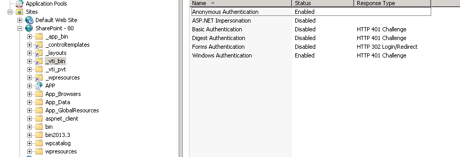

# WebPart Designer Troubleshooting

This article lists some suggestions that can help resolve common issues with the WebPart Designer.

* Use the .msi installer to install the controls. This way any additional resources that are required by the designer will be added automatically

* If you are using Internet Explorer, ensure that **Compatibility Mode** is **Disabled**

* Ensure that only **one version** of the **Telerik.Web.UI** assembly is referenced throughout the whole Sharepoint application. Also in **GAC**, **IIS Sharepoint Bin**(*C:\inetpub\wwwroot\wss\VirtualDirectories\80*) folder and the **web.config**

* If you are adding **RadGrid** or **RadListView** controls open the *C:\Program Files\Common Files\Microsoft Shared\Web Server Extensions\15\TEMPLATE\LAYOUTS\Telerik.Ajax.SharePoint* folder and ensure that the correct version is referenced in the **GridWebPartDesigner.aspx** / **ListViewWebPartDesigner.aspx** files

* Open the *C:\Program Files\Common Files\Microsoft Shared\Web Server Extensions\15\ISAPI\Telerik.Ajax.SharePoint* folder and ensure that the correct version of the controls is referenced in the **gridbindingservice.svc** file

* Check the **vti_bin** folder in the Sharepoint IIS web site and confirm that it has anonymous authentication enabled  

* After the designer is opened check the browser console and the Sharepoint logs for any errors

* Inspect the HTML content of the designer and ensure that all inner controls are loaded as expected

* Examine the files in the *C:\Program Files\Common Files\Microsoft Shared\Web Server Extensions\15\TEMPLATE\LAYOUTS\Telerik.Ajax.SharePoint* folder and ensure that the correct version of the **Telerik.Web.UI.dll** is registered

* Ensure that the Sharepoint administrator and the IIS processes have permission to access the **SPRadGridWebPartDesignerService.asmx** file located in the *C:\Program Files\Common Files\Microsoft Shared\Web Server Extensions\15\ISAPI* folder

* Enable Network traffic capturing in the browser console and check it the requests made to the server are successful when opening the designer

* Disable Forms Authentication in the IIS settings of the current Sharepoint site

* If you are seeing the following error make sure that **Telerik.Web.UI.dll** is present only in one of the folders (either GAC or the Bin folder)

