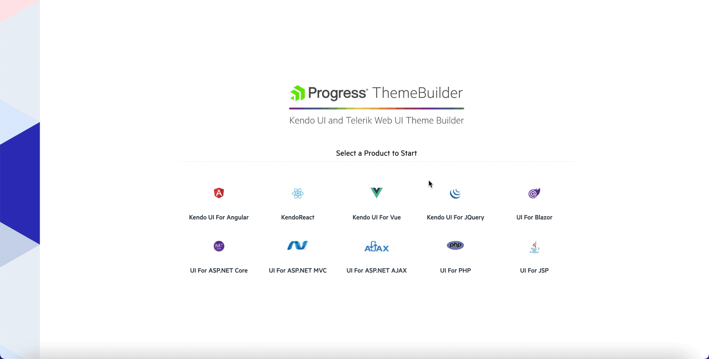

# Creating a Theme

[Progress ThemeBuilder for ASP.NET AJAX](https://themebuilder.telerik.com/aspnet-ajax) is a convenient customization tool that allows you to create your own custom [lightweight](https://docs.telerik.com/devtools/aspnet-ajax/controls/render-modes) skins quickly and efficiently. You can achieve impressive results without the necessity of understanding the underlying HTML and CSS structure of the controls.

>caption The following image shows the main ThemeBuilder interface.

## Creating a New Theme

1. Open [ThemeBuilder](https://themebuilder.telerik.com/aspnet-ajax).
1. Select one of the five base themes.
1. Select **Start Theming**.
1. To reduce the number of the rendered components, open the **SELECT COMPONENTS** screen and check only the UI components that you need.

>caption The following animated gif is an example showing how to get started

## Styling Your Theme

To customize a theme, use any of the following ThemeBuilder features:

* Built-in color swatches&mdash;The color swatches are color variations of the base themes. The swatches use the same variables as their base theme but with different color values. To open the color swatches menu, use the dropdown button with the fill drip icon .

* Color pickers&mdash;All color variables provide color pickers that you can use to set the desired values.

* Manual updates of the component elements&mdash;You can directly enter the desired values into the input field of the selected variable.

## Next Steps
Once you have chosen the desired colors for your theme, you need to [Download and use it in your project]()

## See Also
* [Telerik Sass ThemeBuilder - Overview]()
* [Import and modify an existing skin]()
