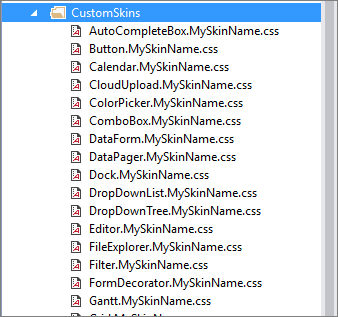

# Downloading and Applying a Custom Theme

Once you [create a custom skin](), you need to download it and apply it in your project. This article walks you through the process.

## Downloading

When you complete your modifications and the theme is ready, select **Export**, enter a name for your theme in the popup, and click **OK**. This will download a ZIP archive with the theme.

>tip To further customize the theme in the future, export the theme in its current state. You can [import]() the theme anytime and continue where you left off.


### File Contents

The downloaded ZIP archive contains:

* The stylesheets for every control you have selected to change&mdash;the stylesheet name includes the name of the control and the name of the custom skin, for example, `[Control].[SkinName].css`.

* The stylesheet for the all components in the theme&mdash;`[SkinName].css`

* A `.json` file that you can use to import the theme in ThemeBuilder and continue editing it.


## Applying

There are several ways to register CSS files and they are described in this section. 

To demonstrate the process, this article styles the RadSlider and RadWizard controls.

````ASP.NET
<telerik:RadSlider ID="RadSlider1" runat="server"></telerik:RadSlider>

<telerik:RadWizard ID="RadWizard1" runat="server"></telerik:RadWizard>
````

### Using Drag and Drop

To register the CSS files, you can use the drag and drop approach:

1. Create a folder anywhere in your project and name it `CustomSkins`.

 

1. Unpack the ZIP file that you downloaded from ThemeBuilder (e.g. MySkinName.zip) and copy the contents into the folder created in the previous step.

 

1. To register the stylesheet for the control you intend to style, drag and drop the file onto the page. You will include two styles: one for RadWizard and another one for RadSlider. If you apply styles to all controls, you must include all stylesheets.

  >note Some of the CSS files generated by ThemeBuilder may include classes with background-images using WebResource URIs that could cause appearance problems. To avoid appearance issues, remove those classes.

  >caption You can safely remove classes similar to the following example:

  ````CSS
  .RadSlider_MySkinName div.rslVertical .rslItem {
      background-image: url('<%=WebResource("Telerik.Web.UI.Skins.MySkinName.Slider.ItemVerticalBgr.png")%>');
  }
````

  >caption The following image shows how to register a stylesheet by dragging and dropping the file into the page head.

  

1. Finally, configure the controls to use the new skins by setting the `EnableEmbeddedSkins` to `false` and the `Skin` property to the name of your custom skin. In this tutorial, it is called `MySkinName`.

  ````ASP.NET
  <telerik:RadSlider ID="RadSlider1" runat="server" EnableEmbeddedSkins="false" Skin="MySkinName">
  </telerik:RadSlider>

  <telerik:RadWizard ID="RadWizard1" runat="server" EnableEmbeddedSkins="false" Skin="MySkinName">
  </telerik:RadWizard>
````

  >caption The following image shows the appearance of both controls before and after you apply the custom skin.

  

Well done! You have successfully created a custom skin and applied it to Telerik controls.

### Declaratively: Using Link Tags

And alternative to the [drag and drop approach](#using-drag-and-drop) is to use link tags.

1. Drag-and-drop the CSS file onto your page. As a result, you end up with the following HTML:

  ````ASP.NET
<head runat="server">
    <title>ThemeBuilder - MySkinName</title>
    <link href="CustomSkins/Slider.MySkinName.css" rel="stylesheet" />
    <link href="CustomSkins/Wizard.MySkinName.css" rel="stylesheet" />
</head>
````

1. Optionally, you can make the `href` attribute of the `<link>` tag application relative: insert a tilde `~/` and add `runat="server"`.

  ````ASP.NET
<head runat="server">
    <title>ThemeBuilder - MySkinName</title>
    <link id="Link1" href="~/CustomSkins/Slider.MySkinName.css" rel="stylesheet" runat="server" />
    <link id="Link2" href="~/CustomSkins/Wizard.MySkinName.css" rel="stylesheet" runat="server" />
</head>
````


### Programmatically: Using Link Tags

You can register the CSS file of the skin by adding a `HtmlLink` control in the `Header` property of your Page. The `<head>` tag must include the `runat="server"` attribute.

````C#
HtmlLink link = new HtmlLink();
link.Href = "~/CustomSkins/Slider.MySkinName.css";
link.Attributes.Add("type", "text/css");
link.Attributes.Add("rel", "stylesheet");
Page.Header.Controls.Add(link);

link = new HtmlLink();
link.Href = "~/CustomSkins/Wizard.MySkinName.css";
link.Attributes.Add("type", "text/css");
link.Attributes.Add("rel", "stylesheet");
Page.Header.Controls.Add(link);
````
````VB
Dim link As New HtmlLink
link.Href = "~/CustomSkins/Slider.MySkinName.css"
link.Attributes.Add("type", "text/css")
link.Attributes.Add("rel", "stylesheet")
Page.Header.Controls.Add(link)

link = New HtmlLink
link.Href = "~/CustomSkins/Slider.MySkinName.css"
link.Attributes.Add("type", "text/css")
link.Attributes.Add("rel", "stylesheet")
Page.Header.Controls.Add(link)
````

### Declaratively: Using RadStyleSheetManager

Using the [RadStyleSheetManager](https://www.telerik.com/help/aspnet-ajax/radstylesheetmanager.html) control to register CSS files can be beneficial in several ways and in some cases, it may be even required:

* RadStyleSheetManager can improve the page performance by combining the CSS files into one and thus, reducing the number of HTTP requests.

* RadStyleSheetManager allows you to register a built-in skin CSS file for a control that is not present on the page&mdash;you can add the control to the page later, or you may want to use the built-in skin for generic HTML content.

````ASP.NET
<head runat="server">
    <title>ThemeBuilder - MySkinName</title>
    <telerik:RadStyleSheetManager ID="RadStyleSheetManager1" runat="server">
        <StyleSheets>
            <telerik:StyleSheetReference Path="~/CustomSkins/Slider.MySkinName.css" />
            <telerik:StyleSheetReference Path="~/CustomSkins/Wizard.MySkinName.css" />
        </StyleSheets>
    </telerik:RadStyleSheetManager>
</head>
````

StyleSheetManager requires that the folder containing the CSS files is defined through the StyleSheetFolders property. Add the following `<appSetting/>` entry in your *web.config*:

````ASPNET
<appsettings>   
    <add key="Telerik.Web.UI.StyleSheetFolders" value="~/CustomSkins" />
</appsettings>
````

### Programmatically: Using RadStyleSheetManager

You can also add external style sheets to the RadStyleSheetManager from the code-behind:

````C#
  protected void Page_Load(object sender, EventArgs e)
  {
    StyleSheetReference stylesheet = new StyleSheetReference();
    stylesheet.Path = "~/CustomSkins/Slider.MySkinName.css";
    RadStyleSheetManager1.StyleSheets.Add(stylesheet);

    stylesheet = new StyleSheetReference();
    stylesheet.Path = "~/CustomSkins/Wizard.MySkinName.css";
    RadStyleSheetManager1.StyleSheets.Add(stylesheet);
  }
````
````VB
  Protected Sub Page_Load(sender As Object, e As EventArgs) Handles Me.Load
    Dim stylesheet As New StyleSheetReference()
    stylesheet.Path = "~/CustomSkins/Slider.MySkinName.css"
    RadStyleSheetManager1.StyleSheets.Add(stylesheet)

    stylesheet As New StyleSheetReference()
    stylesheet.Path = "~/CustomSkins/Wizard.MySkinName.css"
    RadStyleSheetManager1.StyleSheets.Add(stylesheet)
  End Sub
````

## See Also
  * [Read about Sass ThemeBuilder]()
  * [Open the Sass ThemeBuilder](https://demos.telerik.com/aspnet-ajax/themebuilder/)
  * [Create a new skin]()
  * [Import and modify an existing skin]()
