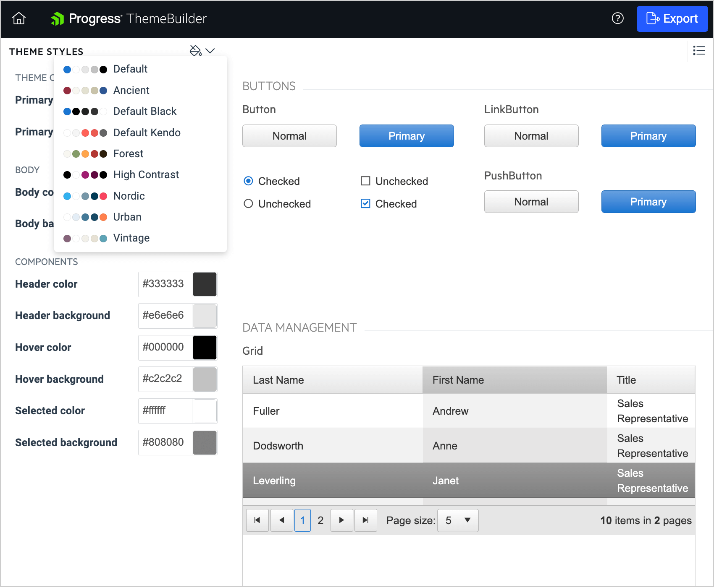

# ThemeBuilder Overview

[Progress ThemeBuilder for ASP.NET AJAX](https://demos.telerik.com/aspnet-ajax/themebuilder/) is a Web application that enables you to create new or customize existing [themes (skins)](https://docs.telerik.com/devtools/aspnet-ajax/general-information/controlling-visual-appearance/how-skins-work) for Telerik UI controls with [lightweight](https://docs.telerik.com/devtools/aspnet-ajax/controls/render-modes) rendering.

With just a few clicks, you can create your own custom theme that applies consistent visual styles to all controls in the suite. The tool gives you complete control over the elements of the control's skin and automatically updates all underlying components in composite controls like the Grid.

## What is a Theme?

A theme dictates the overall look and feel of every product, be it a web site or GUI software. Traditionally, creating a new custom theme consumes significant time, designer involvement and tedious drilling into the element structure of a control.

The web-based ThemeBuilder tool can help you to drastically reduce this effort and achieve the desired look and feel seamlessly while enabling you to concentrate on the design and styling of your new theme.

## Creating or Importing a Theme

You can [create new]() or [import existing]() themes.

### What is a Base Theme?

Base themes are those that you can use as a starting point for your customizations. The currently available base skins are Default, Bootstrap, Material, Silk, and Glow.

## Live Theme Preview

The Theme Preview pane in ThemeBuilder shows the changes that you apply to the styling of the components.

## Next Steps

To customize a skin with the theme builder:

1. [Open ThemeBuilder](https://demos.telerik.com/aspnet-ajax/themebuilder/).
2. [Create new or edit an existing skin]().
3. [Download the new skin and apply it in your project]().

If you have already created a custom skin, you can import it for further editing: [Import an existing set of SASS variables]().

## See Also

 * [Telerik Sass ThemeBuilder for ASP.NET AJAX](https://demos.telerik.com/aspnet-ajax/themebuilder/)
