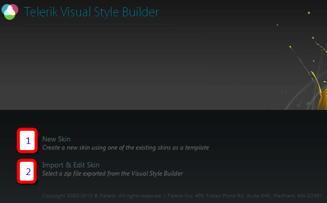
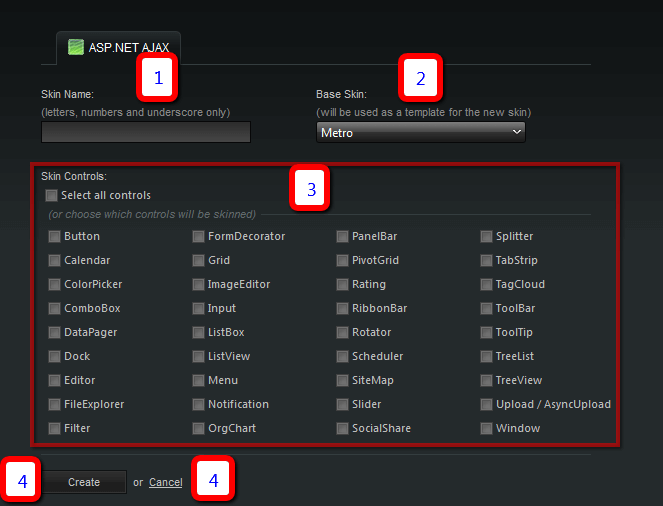
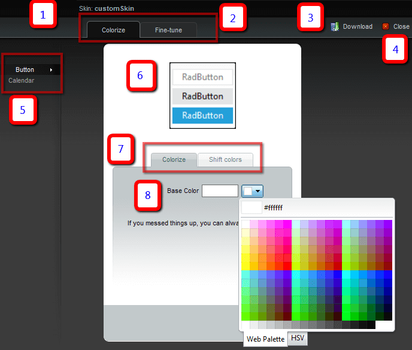
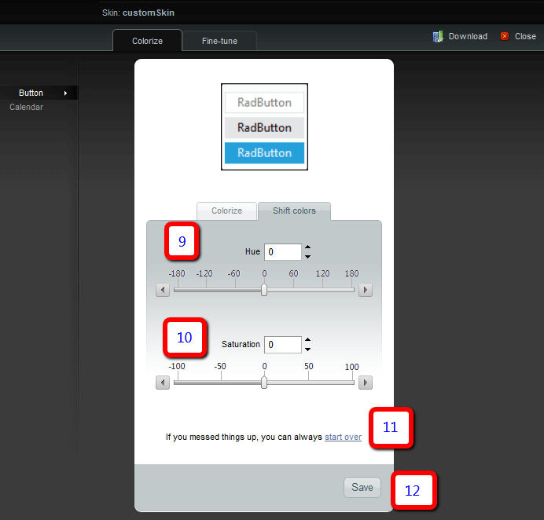

# Basic Usage

The **Visual StyleBuilder** offers two main paths - creating a new skin from an existing one or	[editing an already existing custom skin]().

>important The Visual StyleBuilder tool can be used only for editing the skin-specific stylesheets of the controls. This means that fonts, colours,images can be modified and small changes to paddings and margins can be made, but the base stylesheet will not be altered or included inthe resulting package.

Once the option for creating a new custom skin is selected a new page appears that allows you to select the starting parameters:

1. Choose the name the custom skin will have. It will be used in the CSS selectors and should be given to the control's Skin property to use it.

	>note The skin name cannot be modified at a later stage once the skin has been created.

1. The skin from the built-in ones that will be used as base for creating the custom skin. The closer the source is to the desired effect, the fewer	modifications will be needed.

1. A list with the controls in the suite. The checkboxes can be used to select the controls for which you wish to create a custom skin.

	>note Once the list is chosen it cannot be modified at a later stage to include or exclude controls.

	>tip The "Select all controls" option can be used to choose all controls.

	>note If a chosen control uses other Telerik controls internally they will be present in the list in the next steps even if they have not been checkedexplicitly at this point.

1. Once all other choices have been made the Create button will create the template for the new custom skin and send you to the next steps	to perform the actual customizations.

1. The cancel button can be used to discard the changes and return to the home page.

## Basic Skin Modifications

The first thing that can be done easily is to change the overall color the skin will use:

1. The skin name that was chosen in the previous step.

1. Tabs that can be used to toggle between the basic mode and [Fine-Tuning mode]().

	>note Save the changes with the Save button before toggling the mode or they will be lost.

1. Download the skin with the last saved modifications.

	>note Use the Save button at the bottom of the page to store the changes before downloading the ready archive.

1. Use the Close button to discard all changes and return to the home page to start anew.

1. List with the controls selected in the previous step.

	>note Save the changes with the Save button before clicking on another control or they will be lost.

1. The preview pane shows the end result from the changes in real-time.

1. Toggle between the two color editing modes - basic color choice and advanced modifications on the color.

1. Use the textbox to enter a hex color or the color picker to choose one with a visual interface.

1. Modify the hue of the selected base color either with a numeric textbox, or with the slider.

1. Modify the saturation of the selected base color either with a numeric textbox, or with the slider.

1. Restart the whole process. The same as the Close button (4).

1. Saves the changes made in the browser on the server.

	>note All changes must be saved before navigating to another tab (2, 3, 5, 7) or saving the skin (3),	otherwise they will be lost (or will not be present in the downloaded file).

## See Also

 * [Fine Tuning]()

 * [Edit Existing Skin]()
