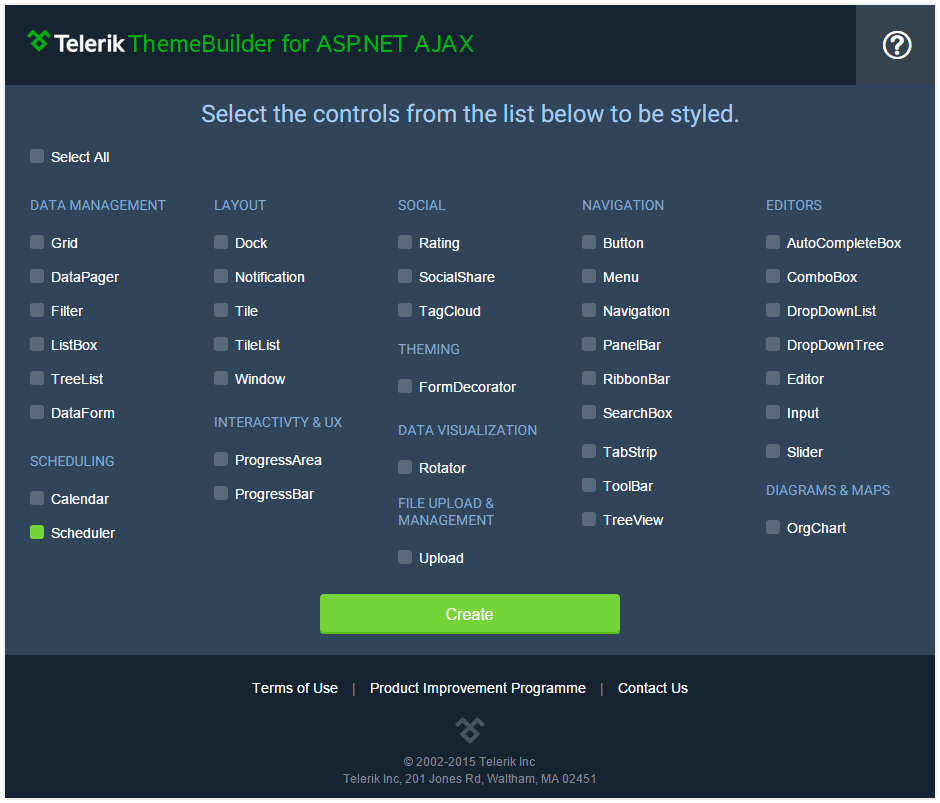
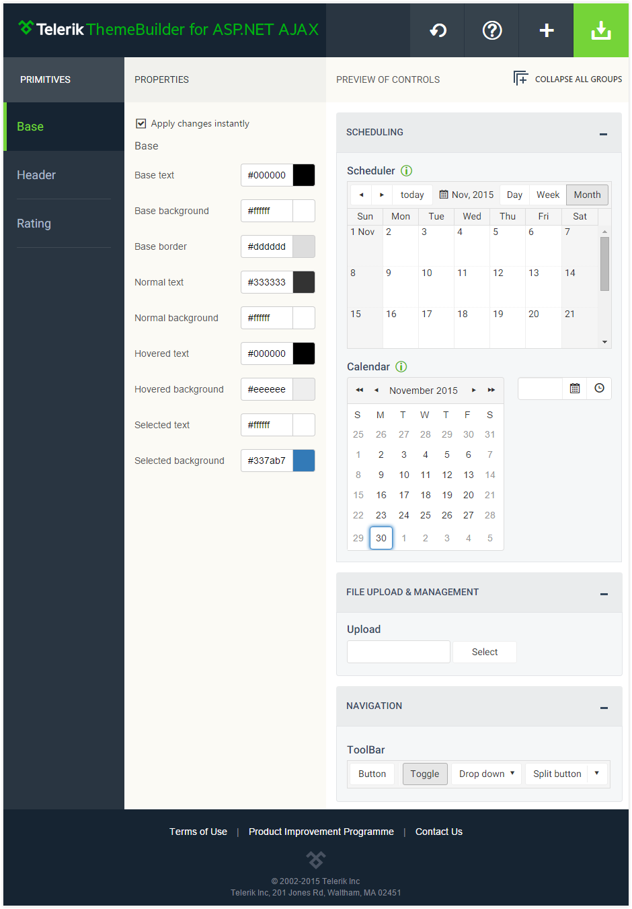

# Composite Controls 

When working with complex controls (e.g. RadGrid, RadScheduler, etc.) the nested components will be included automatically. Thus, you can easily configure the complete look and feel of the composite control.

>note Note that if one of the nested controls is used separately on the page you should set its **Skin** explicitly. To use a custom skin you should also ensure that the **EnableEmbeddedSkins** property is set to **false**.
>

An example for a composite control is the Scheduler control. For illustration we will start making a custom theme for it.

After you click on the **Create** button you will notice that there are additional controls available for styling. In this case a **Calendar** and a **DateTimePicker** controls. This is because they are included in the Scheduler. 

The theme customization process is the same as the one described in the **Create and Download** article. 

## See Also

 * [Telerik ThemeBuilder for ASP.NET AJAX](http://themebuilder.telerik.com/)
 * [Overview]()
 * [Create and Download]()

