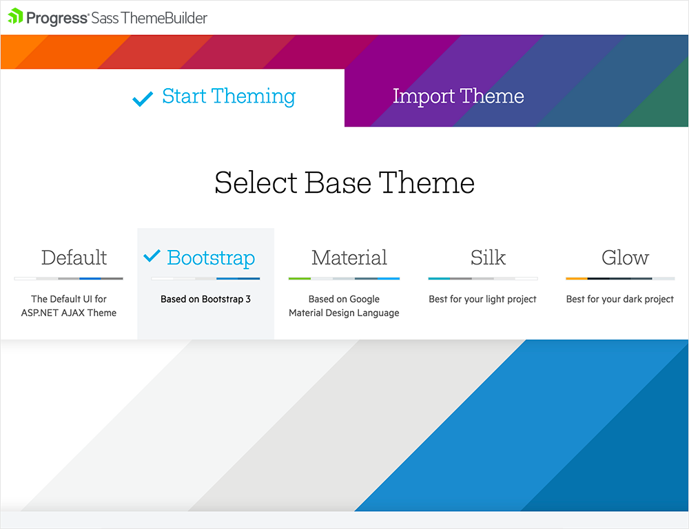
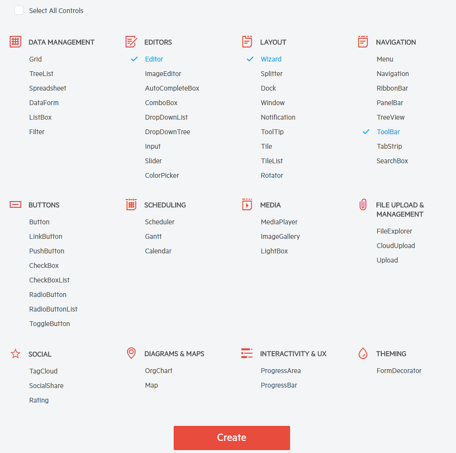
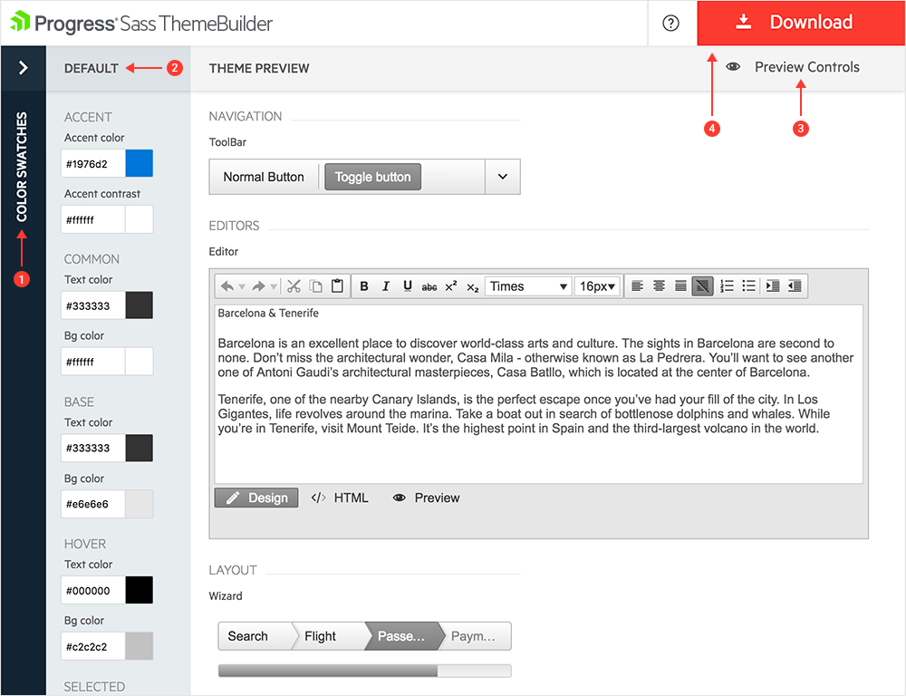

# Create and Download a Theme

##      

The **Sass Theme Builder** for Telerik UI for ASP.NET AJAX is a convenient customization tool providing the ability and power to create your own custom **Lightweight** skins and themes quickly and efficiently. This could be easily achieved without the necessity of understanding the underlying HTML and CSS structure of the controls.

## Creating a New Theme

A theme dictates the overall look and feel of every product, be it a web site or GUI software. Traditionally, creating a new custom theme consumes significant time, designer involvement and tedious drilling into the element structure of a control.

The **Sass Theme Builder** web-based tool can help you drastically reduce this effort and achieve the desired look and feel seamlessly, while enables you to concentrate on the design and styling of your new theme.

First, you need to select the **Start Theming** option. Then select one of the existing Skins to use as a base.

>caption Figure1: Demonstrates the first steps for creating a new Theme.

Then, you can scroll down and select the controls that you want to start customizing. The option to add or remove controls for customization is also available after the initial create of the Theme.

>caption Figure2: Shows a list of controls available for customization trough the Theme Builder.

Some of the controls have composite structures and include other child controls to provide the rich functionality they offer, e.g. RadGrid. The **Sass Theme Builder** applies the selected changes automatically on such controls, so you don't bother to customize them separately.

## Customization

Applying the desired colors is pretty straightforward. The **Theme Builder** provides Color pickers for customizing the appearance of the controls and the changes can be observed on the fly. While you have the possibility to manually alter each element of the controls, we provide you with the ability to use predefined swatches (**see Figure3 #1**).

>caption Figure3: Demonstrates the functionalities available for customization.

**1. Swatches** column contains various predefined pallettes applied on all selected controls.

**2. Theme Colors** column provides the applicable color customization options.

**3. Preview of Controls** keeps the main view of the controls, providing you with the ability to add/remove controls (**see Figure 2**).

**4. Download** button is used after customization is finalized. It downloads the archive holding the generated style files. Once the button is clicked, you will be prompted with a dialog where you can name your theme.

## Download and Apply in a Project

Once you have completed the modifications and the new Theme is ready to be used in a project, you can download it as a compact archive using the Download button (#4 from the previous section).

Add the new Theme folder in your application and follow the steps provided in the last section of the following article in order to set it as the Skin for your controls:

[Using a Custom Skin](http://docs.telerik.com/devtools/aspnet-ajax/controls/grid/appearance-and-styling/modifying-existing-skins#creating-a-custom-skin-basic-steps)

<!--You can also find a runnable web site sample in the code-library below, which was specifically created using **Theme Builder** with the selected controls in the progress of this article - Grid, Calendar and Rating.

[Theme Builder Sample Web Site](http://www.telerik.com/support/code-library/theme-builder-sample-web-site)-->

## See Also

 * [Telerik ThemeBuilder for ASP.NET AJAX](http://themebuilder.telerik.com/)
 * [Overview]()
 * [Importing a Theme]()

