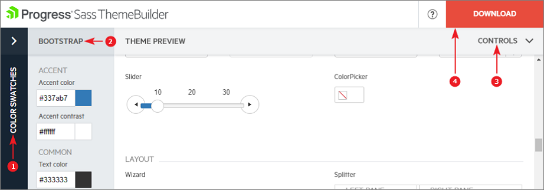
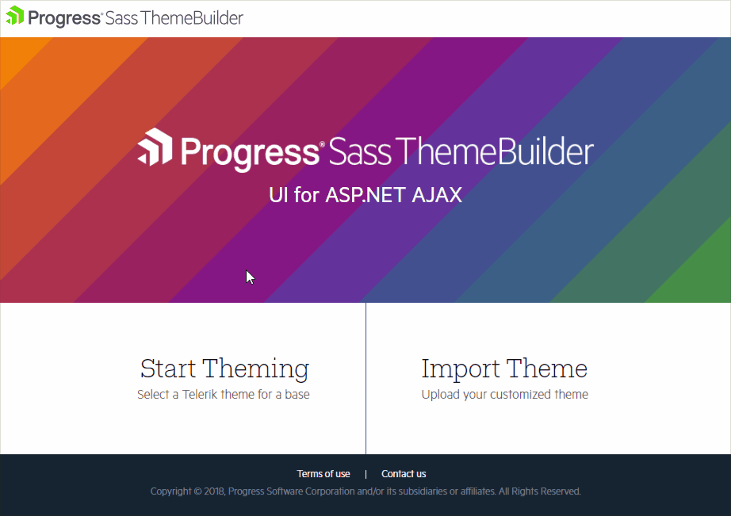
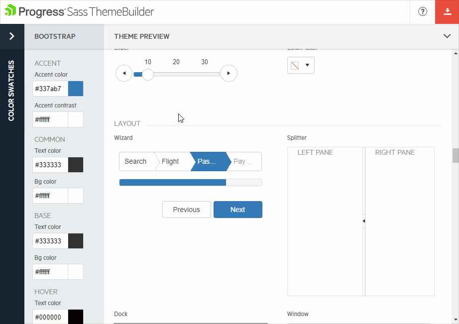
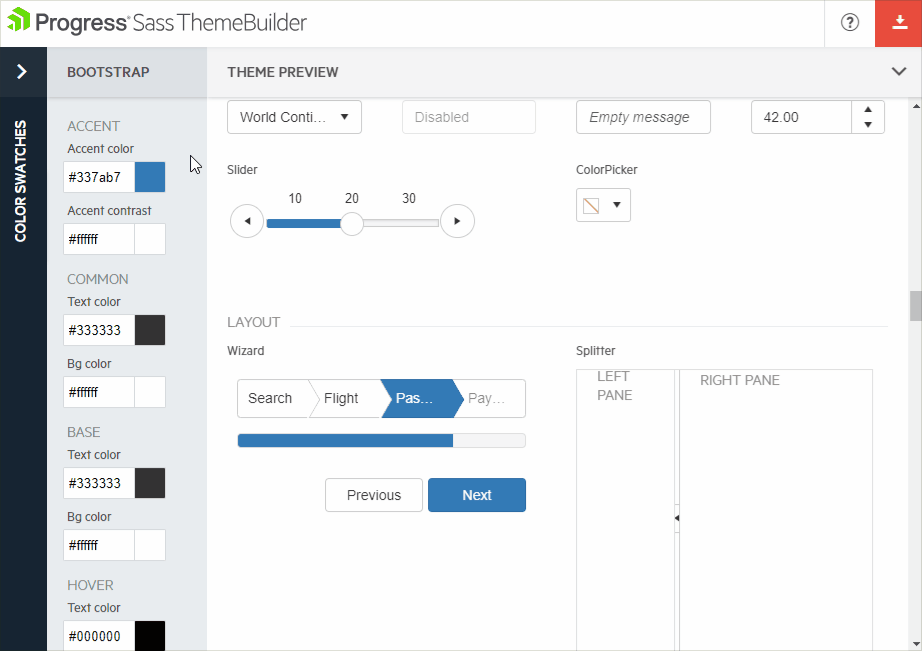

# Create a Theme

The **Sass Theme Builder** for Telerik® UI for ASP.NET AJAX is a convenient customization tool providing the ability and power to create your own custom **Lightweight** skins quickly and efficiently. This can be easily achieved without the necessity of understanding the underlying HTML and CSS structure of the controls.

## Get familiar with the Interface

>caption The following figure describes the usage of the Theme Builder's interface.

1. **Swatches** column contains various predefined pallettes applied on all selected controls.
2. **Theme Colors** column provides the applicable color customization options.
3. **Controls** provides you with the ability to show/hide controls from the Theme Preview.
4. **Download** button is used after customization is finalized. It downloads the archive holding the generated stylesheet files. Once the button is clicked, you will be prompted with a dialog where you can name your skin.

## Creating a New Theme

To get started, open the Theme Builder at [http://themebuilder.telerik.com/aspnet-ajax](http://themebuilder.telerik.com/aspnet-ajax) and click on **Start Theming**.

1. Select one of the existing Skins to use as a base
2. Select the controls which you intend to style
3. Click **Create**.

>caption The following animated gif is an example showing how to get started

## Customize the Colors

>caption Customize Colors: Applying the desired colors is pretty straightforward. The **Theme Builder** provides Color pickers for customizing the appearance of the controls and the changes can be observed on the fly.

## Color Swatches

>caption Color Swatches are a set of pre-defined color combinations that can be used right away or even customized if needed.

## Next Steps
Once you have chosen the desired colors for your theme, you need to [Download and use it in your project]()

## See Also
* [Telerik Sass ThemeBuilder - Overview]()
* [Import and modify an existing skin]()
