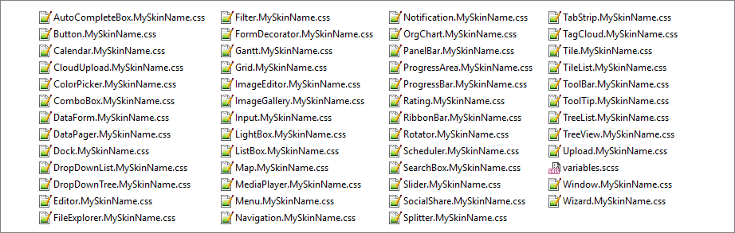
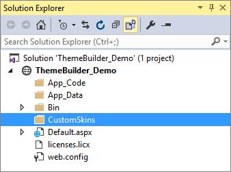
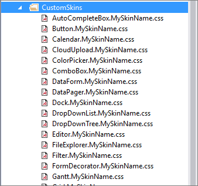
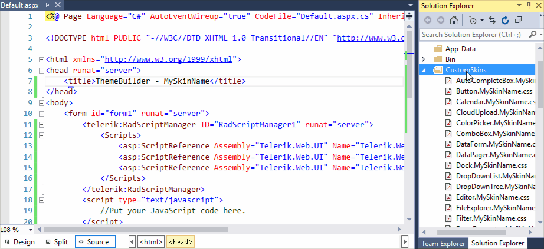
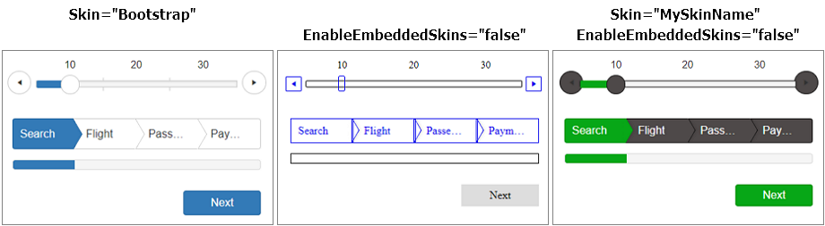

# Download and apply
Once you have [created a custom skin](), you need to download then apply it in your project. This article will walk you through the process.

## Download

Once you have completed the desired modifications, you can download the new skin as a compact archive using the *Download* button.

>tip Save the downloaded file to be able to customize it further in the future. See the [Import]() section.

>caption The following image shows an example for downloading the custom skin.


### File contents

The downloaded .zip archive contains the stylesheets for every control you have selected to change. The stylesheet's name includes the name of the control and the name of the custom skin. For example, `[Control].[SkinName].css`.
The Apply heading must be H2 so it is at the same level as Download
Declaratively - Using link tags. should be H3 to match the rest of the options





## Apply

There are several ways of registering CSS files, one of which, would be as simple as Dragging & Dropping the file to a page. Additional ways for registering the CSS files will be described later in this article.

We will be using **RadSlider** and **RadWizard** to style in this tutorial.

````ASP.NET
<telerik:RadSlider ID="RadSlider1" runat="server"></telerik:RadSlider>

<telerik:RadWizard ID="RadWizard1" runat="server"></telerik:RadWizard>
````

1. To get started, firstly, create a folder anywhere in your Project. We will be using the name **"CustomSkins"** for our demonstration.


2. Extract the downloaded Theme file (e.g. MySkinName.zip) and copy the content into the folder created in the previous step.


3. Register the stylesheet for the control you intend to style by dragging and dropping the file into the page. We will only include two styles, one for **RadWizard** and another one for **RadSlider**. You might need to include all the stylesheets if applying style to all controls.

  >note Some of the CSS files generated by ThemeBuilder may include classes with background-image using WebResource URIs that could cause appearance problems. You might remove those classes to avoid appearance issues.

  >caption You can safely remove classes similar to the following example:

  ````CSS
    .RadSlider_MySkinName div.rslVertical .rslItem {
        background-image: url('<%=WebResource("Telerik.Web.UI.Skins.MySkinName.Slider.ItemVerticalBgr.png")%>');
    }
  ````

  >caption The following image shows how to register a stylesheet by Dragging and Dropping the file into the page head.

  

4. Finally, configure the controls to use the new skins by setting the **EnableEmbeddedSkins** to **false** and the **Skin** property to the name of your custom skin. In our case it is called **MySkinName**.

  ````ASP.NET
  <telerik:RadSlider ID="RadSlider1" runat="server" EnableEmbeddedSkins="false" Skin="MySkinName">
  </telerik:RadSlider>

  <telerik:RadWizard ID="RadWizard1" runat="server" EnableEmbeddedSkins="false" Skin="MySkinName">
  </telerik:RadWizard>
  ````

  >caption The following image shows the look of both controls before and after the custom skin applied.

  


  >note **Well done!** You have **successfully** Created a custom skin and applied it to Telerik Controls.

### Declaratively - Using link tags.

Drag-and-drop the CSS file into your page. You should end up with the following HTML:

````ASP.NET
<head runat="server">
    <title>ThemeBuilder - MySkinName</title>
    <link href="CustomSkins/Slider.MySkinName.css" rel="stylesheet" />
    <link href="CustomSkins/Wizard.MySkinName.css" rel="stylesheet" />
</head>
````

Optionally, you can make the `href` attribute of the `<link>` tag application relative - insert a tilde `~/` - and add `runat="server"`

````ASP.NET
<head runat="server">
    <title>ThemeBuilder - MySkinName</title>
    <link id="Link1" href="~/CustomSkins/Slider.MySkinName.css" rel="stylesheet" runat="server" />
    <link id="Link2" href="~/CustomSkins/Wizard.MySkinName.css" rel="stylesheet" runat="server" />
</head>
````

### Programmatically - Using link tags

You can register the CSS file of the skin by adding a `HtmlLink` control in the `Header` property of your Page. The `<head>` tag must include the `runat="server"` attribute.

````C#
HtmlLink link = new HtmlLink();
link.Href = "~/CustomSkins/Slider.MySkinName.css";
link.Attributes.Add("type", "text/css");
link.Attributes.Add("rel", "stylesheet");
Page.Header.Controls.Add(link);

link = new HtmlLink();
link.Href = "~/CustomSkins/Wizard.MySkinName.css";
link.Attributes.Add("type", "text/css");
link.Attributes.Add("rel", "stylesheet");
Page.Header.Controls.Add(link);
````
````VB
Dim link As New HtmlLink
link.Href = "~/CustomSkins/Slider.MySkinName.css"
link.Attributes.Add("type", "text/css")
link.Attributes.Add("rel", "stylesheet")
Page.Header.Controls.Add(link)

link = New HtmlLink
link.Href = "~/CustomSkins/Slider.MySkinName.css"
link.Attributes.Add("type", "text/css")
link.Attributes.Add("rel", "stylesheet")
Page.Header.Controls.Add(link)
````

### Declaratively - Using RadStyleSheetManager

Using the [RadStyleSheetManager](https://www.telerik.com/help/aspnet-ajax/radstylesheetmanager.html) control to register CSS files, can be beneficial in several ways, or in some cases may be even required:

* RadStyleSheetManager can improve the page performance by combining the CSS files into one on the fly and thus, reducing the number of HTTP requests;

* you can register a built-in skin CSS file for a control, that is not present on the page - the control can be added to the page later, or you may want to use the built-in skin for generic HTML content;

````ASP.NET
<head runat="server">
    <title>ThemeBuilder - MySkinName</title>
    <telerik:RadStyleSheetManager ID="RadStyleSheetManager1" runat="server">
        <StyleSheets>
            <telerik:StyleSheetReference Path="~/CustomSkins/Slider.MySkinName.css" />
            <telerik:StyleSheetReference Path="~/CustomSkins/Wizard.MySkinName.css" />
        </StyleSheets>
    </telerik:RadStyleSheetManager>
</head>
````

StyleSheetManager requires that the folder containing the CSS files is defined through the StyleSheetFolders property. Add the following `<appSetting/>` entry in your *web.config*:

````ASPNET
<appsettings>   
    <add key="Telerik.Web.UI.StyleSheetFolders" value="~/CustomSkins" />
</appsettings>
````

### Programmatically - Using RadStyleSheetManager
You can also add external style sheets to the **RadStyleSheetManager** from the code-behind:

````C#
  protected void Page_Load(object sender, EventArgs e)
  {
    StyleSheetReference stylesheet = new StyleSheetReference();
    stylesheet.Path = "~/CustomSkins/Slider.MySkinName.css";
    RadStyleSheetManager1.StyleSheets.Add(stylesheet);

    stylesheet = new StyleSheetReference();
    stylesheet.Path = "~/CustomSkins/Wizard.MySkinName.css";
    RadStyleSheetManager1.StyleSheets.Add(stylesheet);
  }
````
````VB
  Protected Sub Page_Load(sender As Object, e As EventArgs) Handles Me.Load
    Dim stylesheet As New StyleSheetReference()
    stylesheet.Path = "~/CustomSkins/Slider.MySkinName.css"
    RadStyleSheetManager1.StyleSheets.Add(stylesheet)

    stylesheet As New StyleSheetReference()
    stylesheet.Path = "~/CustomSkins/Wizard.MySkinName.css"
    RadStyleSheetManager1.StyleSheets.Add(stylesheet)
  End Sub
````

## See Also
  * [Read about Sass ThemeBuilder]()
  * [Open the Sass ThemeBuilder](https://themebuilder.telerik.com/aspnet-ajax)
  * [Create a new skin]()
  * [Import and modify an existing skin]()
