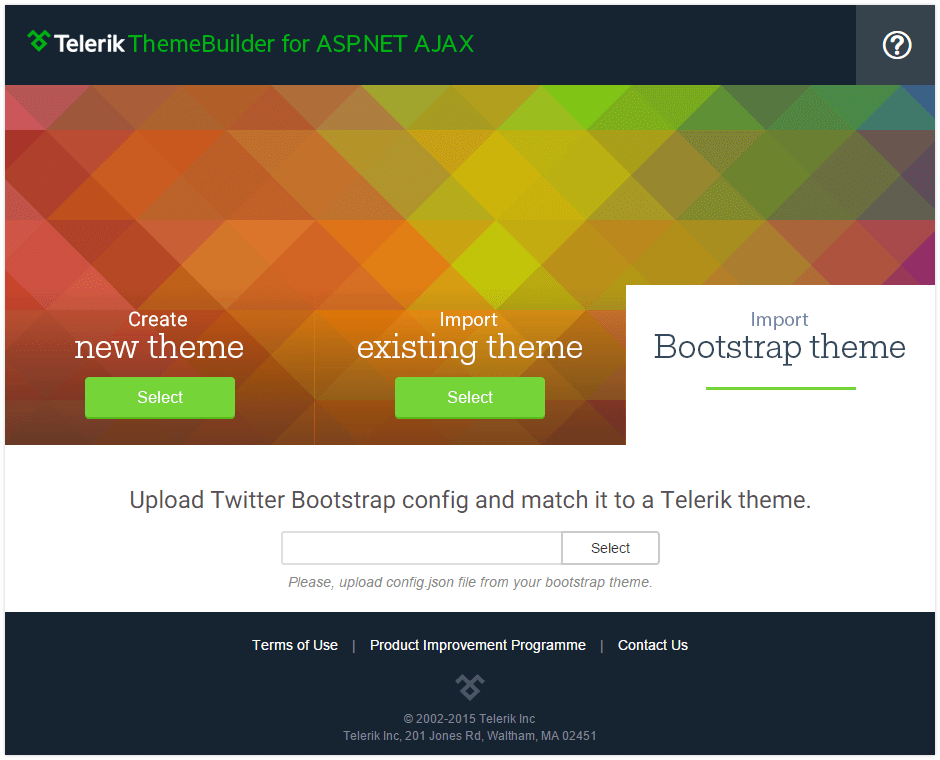

# Import Bootstrap Theme 


The **Import Bootstrap Theme** functionality is currently in development and with limited capabilities.  In order to take advantage of it you need to upload **config.json** file generated by the [Bootstrap customizer tool](http://getbootstrap.com/customize/).



>note You should map the variables from the **“vars”** object according to the convention below in order to import the bootstrap theme successfully:

````
{
    //"$font-size": "@font-size-base",
    //"$line-height": "@line-height-base",
    //"$font-family": "@font-family-sans-serif",
    "$base-color": "@text-color",
    "$base-bg": "@body-bg",
    "$base-border": "@panel-default-border",
    "$brand-primary": "@brand-primary",
    "$link-color": "@link-color",
    "$link-bg": "@pagination-bg",
    "$link-border": "@pagination-border",
    "$link-hovered-color": "@link-hover-color",
    "$link-hovered-bg": "@pagination-hover-bg",
    "$link-hovered-border": "@pagination-hover-border",
    "$link-selected-color": "@pagination-active-color",
    "$link-selected-bg": "@pagination-active-bg",
    "$link-selected-border": "@pagination-active-border",
    "$panel-color": "@panel-default-text",
    "$panel-bg": "@panel-bg",
    "$panel-border": "@panel-default-border",
    "$input-color": "@input-color",
    "$input-bg": "@input-bg",
    "$input-border": "@input-border",
    "$input-focused-border": "@input-border-focus",
    "$button-color": "@btn-default-color",
    "$button-bg": "@btn-default-bg",
    "$button-border": "@btn-default-border",
    "$button-primary-color": "@btn-primary-color",
    "$button-primary-bg": "@btn-primary-bg",
    "$button-primary-border": "@btn-primary-border"
}
````

Currently the Twitter Bootstrap import will not work if you use formula (i.e. lighten(@gray-base, 20%)) as bootstrap variable. Import of Bootstrap theme that is SASS, LESS or CSS based is also not supported 

We continue to collect your feedback and plan to greatly improve the Twitter Bootstrap theme conversion to Telerik Bootstrap themes. If you would like you can share your scenarios and custom Twitter Bootstrap themes with us at [webforms@telerik.com](file://webforms@telerik.com/). 

