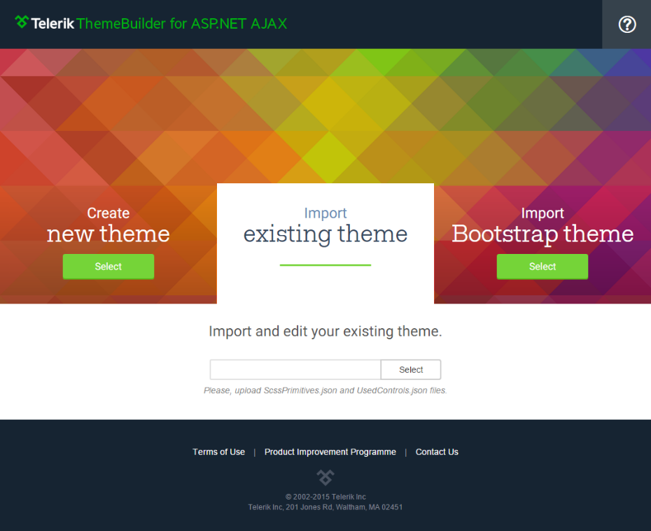

# Importing a Theme 

The **Sass Theme Builder** tool enables you to upload your own theme that you have previously created. You just need to select the *Import existing theme* option.

>note You must upload the **primitives.scss** file or both **ScssPrimitives.json** and **UsedControls.json** files if you had used the previos version of the Theme Builder.

Once you have uploaded the theme you can customize it as described in the [create and download]() article. 
