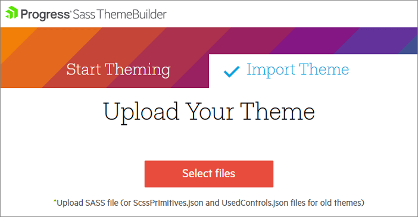

# Importing a Theme

The **Sass Theme Builder** tool provides you with the ability to upload and import a theme that you previously created,so you can modify it further. To get started, open the [Sass ThemeBuilder](https://themebuilder.telerik.com/aspnet-ajax) click on *Import Theme* option, then click on *Select Files*.

>note You must upload the **variables.scss** file.
>
> If you had used the previous version of the Theme Builder, you must upload both **ScssPrimitives.json** and **UsedControls.json** files

>caption Click on Import Theme

>caption Click on Select files

Once you have uploaded the theme you can customize it as described in the [Create]() article.

## See Also
  * [Read about Sass ThemeBuilder]()
  * [Open the Sass ThemeBuilder](https://themebuilder.telerik.com/aspnet-ajax)
  * [Create a new skin]()
