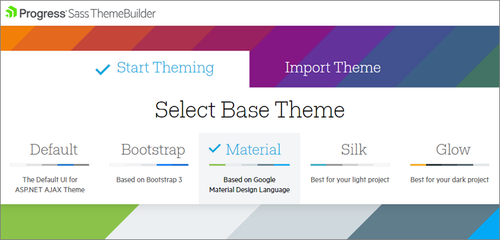
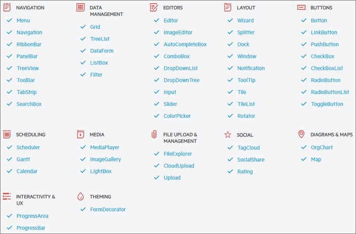
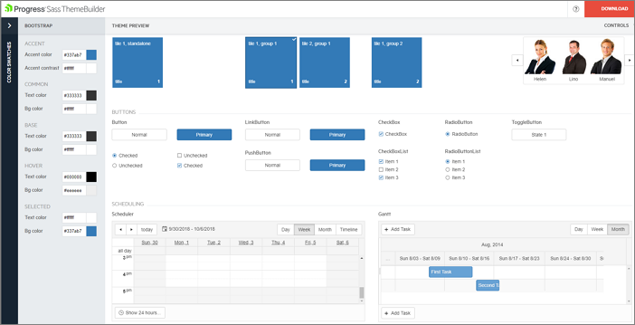

# Sass Theme Builder Overview

**Progress Sass Theme Builder** for ASP.NET AJAX is a Web application that provides you with the ability to create new or customize existing [themes (skins)](https://docs.telerik.com/devtools/aspnet-ajax/general-information/controlling-visual-appearance/how-skins-work) for Telerik UI controls with **[Lightweight](https://docs.telerik.com/devtools/aspnet-ajax/controls/render-modes)** rendering. You can find it at [https://themebuilder.telerik.com/aspnet-ajax](https://themebuilder.telerik.com/aspnet-ajax)

With just a few clicks you can create your own custom theme with the same look and feel for all controls in the suite. The tool gives you complete control over the elements of the control’s skin along with automatic updates to its composite controls.

## What is a Theme?
A theme dictates the overall look and feel of every product, be it a web site or GUI software. Traditionally, creating a new custom theme consumes significant time, designer involvement and tedious drilling into the element structure of a control.

The **Sass Theme Builder** web-based tool can help you drastically reduce this effort and achieve the desired look and feel seamlessly, while enables you to concentrate on the design and styling of your new theme.

## Create a new Theme or Import existing

>caption You can Create new theme or Import existing one to be styled.

## Base Themes

>caption The currently available built-in skins based on which you can create your own theme are Default, Bootstrap, Material, Silk and Glow.

## List of Controls

>caption Below you can find a list of all controls that can be styled through this powerful tool:

## Live Theme Preview

>caption Theme Preview panel shows the changes on the fly

## Next Steps

To create a custom skin with the theme builder, you need to:

1. [Open the Telerik Sass ThemeBuilder](https://themebuilder.telerik.com/aspnet-ajax)
2. [Create new or edit an existing skin]()
3. [Download the new skin and apply it in your project]()

If you have already created a custom skin, you can Import it for further editing: [Import an existing set of SASS variables to the tool]()

## See Also

 * [Telerik Sass ThemeBuilder for ASP.NET AJAX](https://themebuilder.telerik.com/aspnet-ajax)
