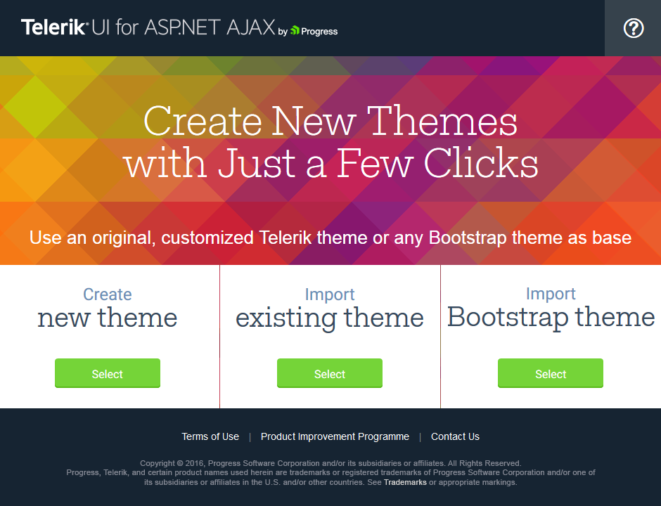

# Sass Theme Builder Overview

**Progress Sass Theme Builder** for ASP.NET AJAX is a Angular 2 Web application that provides you with the ability to create new or customize existing themes for Telerik UI controls with **Lightweight** rendering. It can be found at [http://themebuilder.telerik.com/aspnet-ajax](http://themebuilder.telerik.com/aspnet-ajax).

Just with a few clicks you can create your own custom theme with the same look and feel for all controls in the suite. The tool gives you complete control over the elements of the control’s skin along with automatic updates to its composite controls.  Once the skin is created and the new Theme looks as you expected in the Preview pane you can download it with one click and integrate it in your project. 

>tip After you create the custom skin you will need to [register]() it on the page where it will be used (for every control you would like to style, its stylesheet should be registered individually).

The currently available built-in skins based on which you can create your own theme are **Default, Bootstrap, Material, Silk** and **Glow**. Below you can find a list of all controls with **RenderMode=”Lightweight”** that can be styled through this powerful tool:

## Import

The tool also offers import and edit functionality of an existing theme. For this purpose, you just need to upload your **variables.scss** file. If you had used the old version of the Theme Builder for customization, you can upload the **ScssPrimitives.json** and **UsedControls.json** files from previously created theme. 

# See Also

 * [Telerik ThemeBuilder for ASP.NET AJAX](http://themebuilder.telerik.com/)
 * [Create and Download]() 
 * [Import]()  
