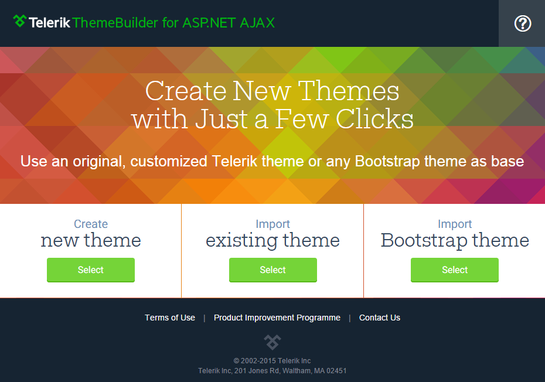

# Theme Builder Overview

##  

**Telerik Theme Builder** for ASP.NET AJAX is a web application that comes with the ability to create new or customize existing themes for Telerik UI controls with Lightweight rendering. Just with a few clicks you can create your own custom theme with the same look and feel for all controls in the suite. The tool gives you complete control over the elements of the control’s skin along with access to its composite controls.  Once the skin is created and the new Theme looks as you expected in the Preview pane you can download it with one click and integrate it in your project.  

The currently available built-in skins based on which you can create your own theme for Telerik UI controls are **Default** and **Bootsrap**. Below you can find a list of all controls with **RenderMode=”Lightweight”** that can be styled through this powerful tool:

**DATA MANAGEMENT**

* Grid
* DataPager
* Filter
* ListBox
* TreeList
* DataForm

**SCHEDULING**

* Calendar
* Scheduler

**LAYOUT**

* Dock
* Notification
* Tile
* TileList
* Window

**INTERACTIVTY & UX**

* ProgressArea
* ProgressBar

**SOCIAL**

* Rating
* SocialShare
* TagCloud

**THEMING**

* FormDecorator

**DATA VISUALIZATION**

* Rotator

**FILE UPLOAD & MANAGEMENT**

* Upload

**NAVIGATION**

* Button
* Menu
* Navigation
* PanelBar
* RibbonBar
* SearchBox
* TabStrip
* ToolBar
* TreeView

**EDITORS**

* AutoCompleteBox
* ComboBox
* DropDownList
* DropDownTree
* Editor
* Input
* Slider

**DIAGRAMS & MAPS**

* OrgChart

## Import

The tool also offers import and edit of an existing theme. For this purpose you just need to upload **ScssPrimitives.json** and **UsedControls.json** files from previously created theme. 

And last but not least the **Theme Builder** provides the opportunity to import **Bootstrap** theme. This is easy achievable by uploading **config.json** file generate by the [Bootstrap Customizer tool](http://getbootstrap.com/customize/). You should only map the variables from the “vars” object according to the convention attached in the Import Bootstrap Theme article (link to the respective article will be added). With the current version of the web application using formula as bootstrap variable is not supported.

# See Also

 * [Create and Download]() 
 * [Import]()  
 * [Import Bootstrap Theme]() 
 * [Composite Controls]() 
