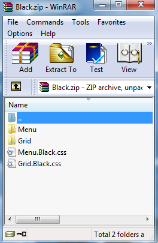

# Edit Existing Skin

The **Visual StyleBuilder** tool offers the option to modify an already existing skin by uploading an archive with the proper structure.	This can be one of the built-in skins or a custom skin.

>note The format of the archive must match the structure the StyleBuilder expects. This isthe structure a skin has in the installation folder of the Telerik UI for ASP.NET AJAX.
>

For instance, if you need to alter the Black skin of the RadGrid Control you will need to go to	*[Telerik UI for ASP.NET AJAX installation folder] [your version of the controls here]\Skins\Black*,	get the folder containing the images needed for the control (named Grid in this example) and the stylesheet applied for the black skin -	*Grid.Black.css* file –	and archive them into a single file (for example this could be Black.zip).

>tip Some of the Telerik controls are composite controls and use other controls from the suite internally. These additional controls must also be included in the archivewith the main one. You can see a list with the required minimum by trying to create a new skin in the StyleBuilder and selecting only the desired control.
>

Here follows an example how several controls that are used together should look like when archived. Having more than one control does not change the structure of the archive,	the needed files and folders are merely added. This allows for skinning several controls at a time.

>tip Make sure that the files inside have no custom permissions and attributes - i.e. they should *not* be read-only,access to them should *not* be explicitly limited to given users on the local machine, etc. Having files that cannot be accessed or modified means the Visual StyleBuilder cannot work with them and cannot generate the new archive.
>

## How to edit an existing skin

1. **Get the skin that you need to alter** To get the needed files for one of the built-in skins you can go to *[Telerik UI for ASP.NET AJAX installation folder] [your version of the controls]\Skins*where you can find all of the skins of the controls with the default installation of the Telerik controls)so you can choose the skin whose styles you need to alter.You can also use a custom skin that has already been implemented.

1. Choose the **Import and Edit Skin** option form the first page inVisual Style Builder and choose to the folder containing the skin (*Black.zip* for this example) file.The Visual Style Builder is designed in a way to automatically detect the control whose skin you are editing.Thus, it will display the controls whose skin you imported in step two on the left hand side of the screen.

1. Proceed to edit the existing styles as described in the **[Fine Tuning section]()**.

1. When you are done with all changes for the Grid only, you will need to preserve the changes by clicking on the **Save** button (the same step would be repeated for the Menu, whose skin files are included in the .zip file)

1. After saving the changes, you can get the altered skin by using the **Download** button.

1. The next steps would be to extract the file and [use the custom skin]() your project.

# See Also

 * [Fine Tuning]()

 * [Creating a Custom Skin]()
