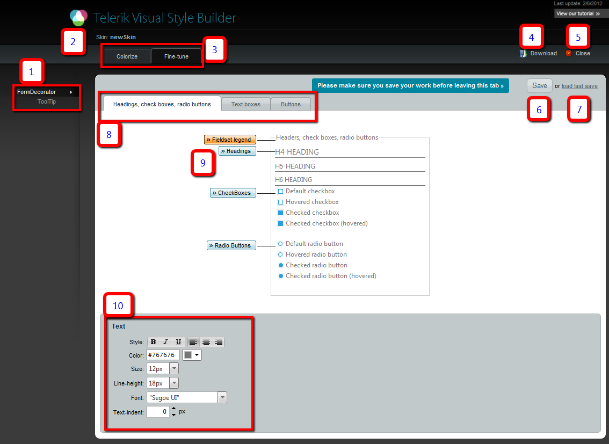

# Fine Tuning

## 

Once the [basic customization]() is done, the skin name and desired controls have been chosenthe __Fine-Tune__ tab can be used to apply detailed effects on a given element inside the control.

Here follows a screenshot where each element of the interface, its functions and usage are explained below:

>note The Save button (6) should be used before navigating between the different tabs (1, 3, 8) to avoid losing data.
>

1. The list with the chosen controls. An arrow marks the one that is being edited.Save the changes with the Save button (6) before going from one to another.This list is chosen in the previous step. It cannot be modified without losing all the changes.

>tip If a selected control uses other Telerik controls internally they will be present in the list as well so they can be styled as desired.
>

1. The name of the skin is shown here. It has been chosen in the previous step and cannot be changed anymore.

1. The tabs which allow toggling between basic color change and fine tuning. Save your changes before navigating across.

1. The download button takes the saved skin and sends it as a zip archive.

>note Only saved changes will be present in the files that will be downloaded. Click the Save button (6) first.
>

1. Click Close to discard all modifications and start over from the top.

1. The save button sends the changes made in the browser to the server. All changes must be saved before navigating accross any tabs(the control list (1), between colorize and fine-tune (3), between the individual control's sections (8)). Changes that are not saved will be lostwhen navigating away.

1. If you don't like the effect the latest changes made, the Load Last Save button will restore the last save that has been made. This acts likean undo mechanism.

1. These tabs list separate sections of the control that can be edited. For example, different elements for RadFormDecorator, different button typesfor RadButton. No tabs will be shown here if no applicable sub-sections of the control exist.

1. The individual elements of the control that can be edited. Click the label that names the element to select it and it will be highlighted in orange.The panel at the bottom (10) will show the applicable styling options where each aspect can be controlled via combo boxes and textboxes with a single click.

>tip All elements from the given tab (8) can be edited before pressing save to navigate away to another tab in (8), (3) or (1).
>

1. Detailed configuration panel. Depending on the selected element (9) the applicable styling options will be listed here - background color/images,fonts, margins and paddings, etc.

>note The CSS rules created with the fine-tune functionality are added to the end of the skin-specific stylesheet that will be created for the given control.	The stylesheets in the archive the tool outputs are minified. The changes added by the StyleBuilder are not minified.	This allows for applying additional modifications manually at a later stage.
>

>note A rule that has already been created by using the UI and clicking the Save button (6) cannot be removed through the StyleBuilder.	It can be removed manually after downloading the skin. For example, if a background color is chosen, then a background image, both rules will	be present in the CSS file, one after the other.
>

# See Also

 * [Basic Usage]()
