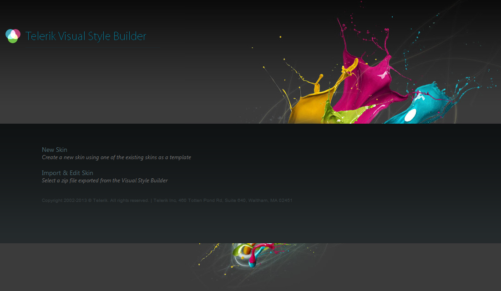

# Visual StyleBuilder Overview

The **Visual StyleBuilder** is a tool that can be used to create the base for custom skins for the Telerik controls. It provides an interactive UI that helps in customizing the appearance of the skin. It can be found at [http://stylebuilder.telerik.com/](http://stylebuilder.telerik.com/).

The main features in the tool are:

* Changing the main color of an existing skin with just a few clicks

* Modifying the skin for one control only or for a set of controls

* Fine tuning individual elements in the control, e.g. fonts, backgrounds, paddings

* Editing an already existing skin that can be uploaded as an archive

* Does not require installation, runs directly in your browser

